# Agent Friday (nexus-os) — Living Architecture Document

> **Method**: Adapted from Nick Tune's Domain-Driven Architecture mapping for monorepo Electron applications.
> **Last updated**: 2026-02-26
> **Scope**: Complete system — main process, renderer, IPC bridge, agents, connectors, gateway, MCP.

---

## Table of Contents

1. [System Context](#1-system-context)
2. [Bounded Contexts](#2-bounded-contexts)
3. [Main Process Module Map](#3-main-process-module-map)
4. [Renderer Component Hierarchy](#4-renderer-component-hierarchy)
5. [IPC Bridge Contract](#5-ipc-bridge-contract)
6. [Data Flow: Audio Pipeline](#6-data-flow-audio-pipeline)
7. [Data Flow: Memory Lifecycle](#7-data-flow-memory-lifecycle)
8. [Data Flow: Tool Execution Chain](#8-data-flow-tool-execution-chain)
9. [Data Flow: Session Management](#9-data-flow-session-management)
10. [Data Flow: Agent Task Pipeline](#10-data-flow-agent-task-pipeline)
11. [Swim Lane: User Interaction Cycle](#11-swim-lane-user-interaction-cycle)
12. [Swim Lane: First-Run Experience](#12-swim-lane-first-run-experience)
13. [Dependency Graph](#13-dependency-graph)
14. [Visual System Architecture](#14-visual-system-architecture)
15. [Security Boundary Map](#15-security-boundary-map)

---

## 1. System Context

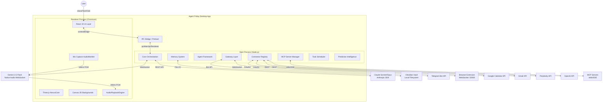

### Key External Dependencies

| Service | Protocol | Purpose | Module |
|---------|----------|---------|--------|
| Gemini 2.5 Flash | WebSocket (Native Audio) | Voice conversation, tool calls, real-time reasoning | `gemini-live.ts` via `useGeminiLive.ts` |
| Claude Sonnet/Opus | REST (Anthropic SDK) | Deep analysis, memory consolidation, psych profiles, code review | `server.ts`, `personality.ts` |
| Obsidian | Local filesystem | Bidirectional memory mirroring | `obsidian-sync.ts` |
| Telegram | Bot HTTP API | Message gateway (inbound/outbound) | `telegram-gateway.ts` |
| Google Calendar | OAuth2 REST | Calendar read/write | `google-calendar.ts` |
| Gmail | OAuth2 REST | Email read/compose/send | `gmail.ts` |
| Perplexity | REST API | Web search with citations | `perplexity.ts` |
| OpenAI | REST API | Image generation (DALL-E 3), TTS, GPT fallback | `openai-services.ts` |
| MCP Servers | stdio/SSE | Extensible tool protocol | `mcp-manager.ts` |
| Browser Extension | WebSocket :52836 | Tab control, screenshots, DOM interaction | `browser-connector.ts` |

---

## 2. Bounded Contexts

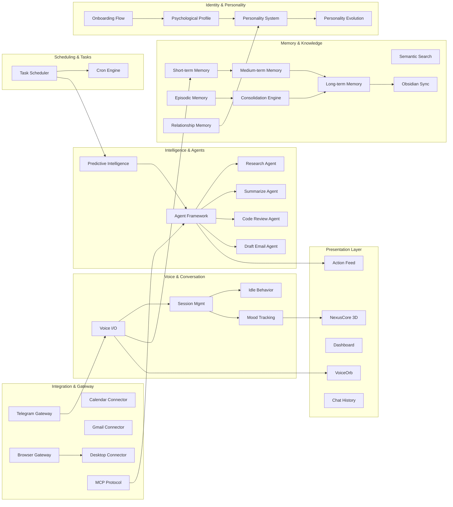

### Context Ownership Table

| Bounded Context | Owner Module(s) | Data Store | Upstream | Downstream |
|----------------|-----------------|------------|----------|------------|
| Voice & Conversation | `useGeminiLive.ts`, `SessionManager.ts` | In-memory | User mic, Gemini WS | Memory, Mood, UI |
| Short-term Memory | `memory.ts` | In-memory (20 entries) | Conversation | Medium-term promotion |
| Medium-term Memory | `memory.ts` | `eve-data/observations.json` (30 entries) | Short-term | Long-term promotion, Consolidation |
| Long-term Memory | `memory.ts` | `eve-data/memories.json` (unlimited) | Consolidation, direct save | Obsidian sync, Semantic search |
| Episodic Memory | `episodic-memory.ts` | `eve-data/episodes.json` (200 cap) | Session end | Consolidation, Search |
| Relationship Memory | `relationship-memory.ts` | `eve-data/relationship.json` (singleton) | Session events | Personality, Greeting |
| Consolidation | `memory-consolidation.ts` | N/A (transforms) | Medium-term, Episodes | Long-term |
| Semantic Search | `semantic-search.ts` | In-memory embeddings | All memory tiers | Query responses |
| Predictive Intelligence | `predictive-intelligence.ts` | `eve-data/intelligence-*.json` | Ambient context, Sentiment | Briefings, Check-ins |
| Agent Framework | `agent-framework.ts` | In-memory task queue | Tool calls, Scheduler | Claude API, Results |
| Gateway | `telegram-gateway.ts`, `browser-connector.ts` | N/A (passthrough) | External messages | Conversation injection |
| Connectors | `google-calendar.ts`, `gmail.ts`, etc. | OAuth tokens in settings | Tool calls | API responses |
| MCP | `mcp-manager.ts` | Server configs in settings | Tool calls | stdio/SSE servers |
| Scheduler | `task-scheduler.ts` | `eve-data/scheduled-tasks.json` | User commands, Intelligence | Cron execution |
| Identity | `onboarding.ts`, `personality.ts` | `eve-settings.json` | First-run flow | All personality-aware modules |
| Presentation | React components | React state, MoodContext | All main process data | User display |

---

## 3. Main Process Module Map

```mermaid
graph TD
    INDEX[index.ts<br/>Entry Point & IPC Hub]

    subgraph "Core Services"
        SERVER[server.ts<br/>Claude Anthropic Client]
        GEMINI[gemini-live.ts<br/>Gemini WebSocket Manager]
        SETTINGS[settings.ts<br/>Persistent Settings Store]
    end

    subgraph "Memory Domain"
        MEMORY[memory.ts<br/>3-Tier Memory Manager]
        EPISODIC[episodic-memory.ts<br/>Session Summarizer]
        RELATIONSHIP[relationship-memory.ts<br/>User Bond Tracker]
        CONSOLIDATION[memory-consolidation.ts<br/>6hr Promotion Engine]
        SEMANTIC[semantic-search.ts<br/>Embedding + Cosine Sim]
        OBSIDIAN[obsidian-sync.ts<br/>Vault Mirroring]
    end

    subgraph "Intelligence Domain"
        AMBIENT[ambient.ts<br/>30s Polling Context]
        SENTIMENT[sentiment.ts<br/>Mood Classification]
        PREDICTIVE[predictive-intelligence.ts<br/>Briefings & Check-ins]
        WORLD[world-monitor.ts<br/>News + Weather + Stocks]
    end

    subgraph "Agent Domain"
        AGENT_FW[agent-framework.ts<br/>Task Queue + Execution]
        AGENT_TYPES[agent-types/<br/>research, summarize,<br/>code-review, draft-email]
    end

    subgraph "Integration Domain"
        TELE_GW[telegram-gateway.ts<br/>Bot API Bridge]
        BROWSER_CONN[browser-connector.ts<br/>WS :52836 Bridge]
        GCAL[google-calendar.ts<br/>OAuth2 Calendar]
        GMAIL_CONN[gmail.ts<br/>OAuth2 Email]
        DESKTOP[desktop-tools.ts<br/>Window/App/Clipboard]
        MCP_MGR[mcp-manager.ts<br/>Multi-Server Protocol]
        PERPLEXITY[perplexity.ts<br/>Search w/ Citations]
        OPENAI[openai-services.ts<br/>DALL-E + TTS + GPT]
    end

    subgraph "Scheduling Domain"
        SCHEDULER[task-scheduler.ts<br/>Persistent Cron]
    end

    subgraph "Identity Domain"
        PERSONALITY[personality.ts<br/>System Prompt Builder]
        ONBOARDING[onboarding.ts<br/>First-Run Flow]
        PSYCH[psychological-profile.ts<br/>Claude Psych Analysis]
        FEATURE_SETUP[feature-setup.ts<br/>9-Step Guided Setup]
        EVOLUTION[personality-evolution.ts<br/>Visual Trait Mapping]
    end

    subgraph "Infrastructure"
        PRELOAD[preload.ts<br/>IPC Bridge / contextBridge]
        TOOLS[tools.ts<br/>Gemini Tool Declarations]
        CLIPBOARD[clipboard-monitor.ts<br/>Polling Clipboard]
        SESSION_HEALTH[session-health.ts<br/>Uptime & Error Tracking]
    end

    INDEX --> SERVER
    INDEX --> GEMINI
    INDEX --> SETTINGS
    INDEX --> MEMORY
    INDEX --> EPISODIC
    INDEX --> RELATIONSHIP
    INDEX --> CONSOLIDATION
    INDEX --> SEMANTIC
    INDEX --> OBSIDIAN
    INDEX --> AMBIENT
    INDEX --> SENTIMENT
    INDEX --> PREDICTIVE
    INDEX --> AGENT_FW
    INDEX --> TELE_GW
    INDEX --> BROWSER_CONN
    INDEX --> GCAL
    INDEX --> GMAIL_CONN
    INDEX --> DESKTOP
    INDEX --> MCP_MGR
    INDEX --> SCHEDULER
    INDEX --> PERSONALITY
    INDEX --> ONBOARDING
    INDEX --> CLIPBOARD
    INDEX --> SESSION_HEALTH
    INDEX --> PRELOAD

    MEMORY --> SEMANTIC
    MEMORY --> OBSIDIAN
    CONSOLIDATION --> SERVER
    CONSOLIDATION --> MEMORY
    EPISODIC --> SERVER
    PREDICTIVE --> SERVER
    PREDICTIVE --> AMBIENT
    PREDICTIVE --> SENTIMENT
    AGENT_FW --> SERVER
    AGENT_FW --> AGENT_TYPES
    ONBOARDING --> PSYCH
    PSYCH --> SERVER
    PERSONALITY --> SETTINGS
    PERSONALITY --> RELATIONSHIP
    EVOLUTION --> SETTINGS
    TOOLS --> DESKTOP
    TOOLS --> MCP_MGR
    TELE_GW --> GEMINI
    SCHEDULER --> SETTINGS
```

### Module Coupling Analysis

| Module | Fan-In | Fan-Out | Coupling Level | Notes |
|--------|--------|---------|----------------|-------|
| `index.ts` | 1 (electron) | 30+ | **Hub** | Central IPC registration — expected for Electron main |
| `settings.ts` | 20+ | 0 | **Afferent hub** | Read by nearly everything, writes from few |
| `server.ts` | 8 | 1 (Anthropic SDK) | **Shared service** | Claude API client used by consolidation, episodic, predictive, agents, psych |
| `memory.ts` | 5 | 3 | **Domain core** | Semantic search, Obsidian sync, settings |
| `agent-framework.ts` | 3 | 5 | **Orchestrator** | Routes to agent types, uses Claude |
| `preload.ts` | 1 | 0 | **Bridge** | Pure declaration, no logic dependencies |

---

## 4. Renderer Component Hierarchy

```mermaid
graph TD
    APP[App.tsx<br/>State Machine: AppPhase]

    subgraph "Global Wrappers"
        EB[ErrorBoundary.tsx<br/>Crash Recovery]
        MOOD_CTX[MoodContext.tsx<br/>Mood State Provider]
    end

    subgraph "Phase: Gate"
        WELCOME[WelcomeGate.tsx<br/>API Key Entry]
    end

    subgraph "Phase: Onboarding/Creating"
        AGENT_CREATE[AgentCreation.tsx<br/>Cinematic Reveal]
    end

    subgraph "Phase: Normal — Always Visible"
        NEXUS[NexusCore.tsx<br/>Three.js 5-Layer 3D]
        WIRE[WireframeNetwork.tsx<br/>Canvas 2D Primary BG]
        PARTICLE[ParticleBackground.tsx<br/>Canvas 2D Fallback BG]
        ORB[VoiceOrb.tsx<br/>Central Interaction Point]
        STATUS[StatusBar.tsx<br/>Bottom Status Strip]
        ACTION[ActionFeed.tsx<br/>Tool/Agent Activity Ticker]
    end

    subgraph "Phase: Normal — Overlays (Toggle)"
        CHAT[ChatHistory.tsx<br/>Conversation Log]
        TEXT_IN[TextInput.tsx<br/>Text Message Entry]
        SETTINGS[Settings.tsx<br/>Configuration Panel]
        DASH[Dashboard.tsx<br/>Command Center]
        AGENT_DASH[AgentDashboard.tsx<br/>Agent Task Monitor]
        MEM_EXP[MemoryExplorer.tsx<br/>Memory Browser]
        QUICK[QuickActions.tsx<br/>Command Palette]
        CONN_ERR[ConnectionOverlay.tsx<br/>Error Recovery]
    end

    subgraph "Dashboard Sub-Components"
        CTX_CARD[ContextCard.tsx<br/>Live Ambient Context]
        AGENT_CARD[AgentCard.tsx<br/>Agent Summary]
        MOOD_TL[MoodTimeline.tsx<br/>SVG Mood Chart]
    end

    APP --> EB
    EB --> MOOD_CTX

    MOOD_CTX --> WELCOME
    MOOD_CTX --> AGENT_CREATE
    MOOD_CTX --> NEXUS
    MOOD_CTX --> WIRE
    MOOD_CTX --> PARTICLE
    MOOD_CTX --> ORB
    MOOD_CTX --> STATUS
    MOOD_CTX --> ACTION
    MOOD_CTX --> CHAT
    MOOD_CTX --> TEXT_IN
    MOOD_CTX --> SETTINGS
    MOOD_CTX --> DASH
    MOOD_CTX --> AGENT_DASH
    MOOD_CTX --> MEM_EXP
    MOOD_CTX --> QUICK
    MOOD_CTX --> CONN_ERR

    DASH --> CTX_CARD
    DASH --> AGENT_CARD
    DASH --> MOOD_TL
```

### Component State Machine (App.tsx)

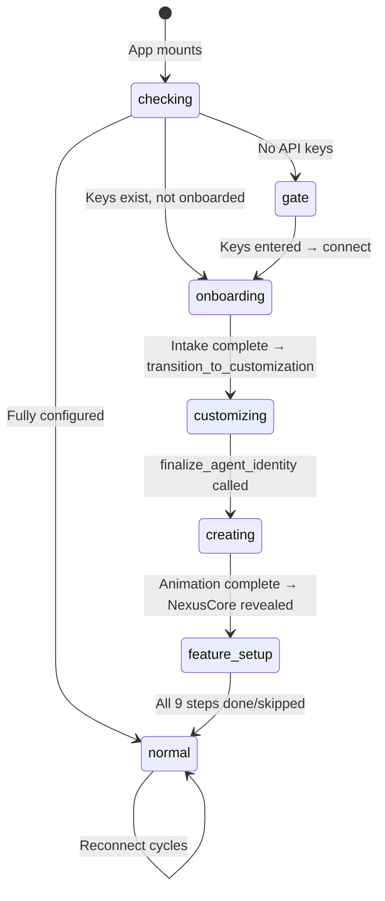

### Z-Index Layer Stack

| Z-Index | Component | Visibility |
|---------|-----------|------------|
| 200 | WelcomeGate | Gate phase only |
| 120 | QuickActions | Toggle (Ctrl+K) |
| 110 | Dashboard | Toggle (Ctrl+Shift+D) |
| 105 | AgentDashboard | Toggle |
| 100 | Settings | Toggle |
| 90 | MemoryExplorer | Toggle (Ctrl+Shift+M) |
| 50 | AgentCreation | Creating phase only |
| 40 | ChatHistory | Toggle |
| 35 | ActionFeed | Always (bottom-left) |
| 30 | ConnectionOverlay | Error state |
| 20 | VoiceOrb | Always (center) |
| 10 | StatusBar | Always (bottom) |
| 5 | NexusCore / WireframeNetwork | Always (background) |

---

## 5. IPC Bridge Contract

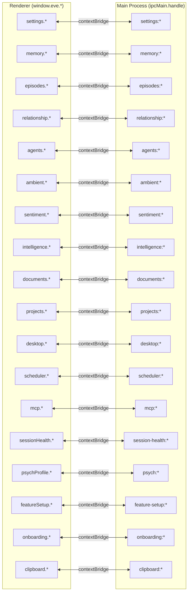

### Full IPC Channel Registry

#### Settings Namespace (`window.eve.settings`)
| Channel | Direction | Signature | Purpose |
|---------|-----------|-----------|---------|
| `settings:get` | invoke | `() → EveSettings` | Read all settings |
| `settings:set` | invoke | `(partial: Partial<EveSettings>) → void` | Update settings |
| `settings:get-api-key` | invoke | `(service: string) → string` | Read API key |
| `settings:set-api-key` | invoke | `(service: string, key: string) → void` | Store API key |
| `settings:get-agent-config` | invoke | `() → AgentConfig` | Read agent identity |
| `settings:set-agent-config` | invoke | `(config: AgentConfig) → void` | Update agent identity |

#### Memory Namespace (`window.eve.memory`)
| Channel | Direction | Signature | Purpose |
|---------|-----------|-----------|---------|
| `memory:get-all` | invoke | `() → MemoryEntry[]` | All long-term memories |
| `memory:save` | invoke | `(entry: MemoryInput) → void` | Save to long-term |
| `memory:search` | invoke | `(query: string) → SearchResult[]` | Semantic search |
| `memory:get-observations` | invoke | `() → Observation[]` | All medium-term observations |
| `memory:get-short-term` | invoke | `() → ShortTermEntry[]` | Current session buffer |
| `memory:consolidate` | invoke | `() → ConsolidationResult` | Trigger manual consolidation |

#### Episodes Namespace (`window.eve.episodes`)
| Channel | Direction | Signature | Purpose |
|---------|-----------|-----------|---------|
| `episodes:get-all` | invoke | `() → Episode[]` | All session summaries |
| `episodes:get-recent` | invoke | `(n: number) → Episode[]` | Last N episodes |
| `episodes:search` | invoke | `(query: string, limit: number) → Episode[]` | Semantic search episodes |
| `episodes:save-current` | invoke | `() → Episode` | Force-save current session |

#### Agents Namespace (`window.eve.agents`)
| Channel | Direction | Signature | Purpose |
|---------|-----------|-----------|---------|
| `agents:list-tasks` | invoke | `() → AgentTask[]` | All tasks (any status) |
| `agents:cancel` | invoke | `(taskId: string) → void` | Cancel running task |
| `agents:get-types` | invoke | `() → AgentTypeInfo[]` | Available agent types |
| `agents:onUpdate` | on | `(callback: (task: AgentTask) → void) → unsub` | Real-time task updates |

#### Ambient Namespace (`window.eve.ambient`)
| Channel | Direction | Signature | Purpose |
|---------|-----------|-----------|---------|
| `ambient:get-context` | invoke | `() → AmbientContext` | Current desktop context |
| `ambient:get-clipboard` | invoke | `() → ClipboardData` | Current clipboard |
| `ambient:onClipboard` | on | `(callback: (data: ClipboardData) → void) → unsub` | Clipboard changes |

#### Desktop Namespace (`window.eve.desktop`)
| Channel | Direction | Signature | Purpose |
|---------|-----------|-----------|---------|
| `desktop:get-active-window` | invoke | `() → WindowInfo` | Active window title/app |
| `desktop:list-windows` | invoke | `() → WindowInfo[]` | All open windows |
| `desktop:focus-window` | invoke | `(title: string) → void` | Focus window by title |
| `desktop:launch-app` | invoke | `(name: string) → void` | Launch application |
| `desktop:run-command` | invoke | `(cmd: string) → string` | Execute shell command |

#### Documents Namespace (`window.eve.documents`)
| Channel | Direction | Signature | Purpose |
|---------|-----------|-----------|---------|
| `documents:pick-and-ingest` | invoke | `() → IngestResult` | File picker → ingest |
| `documents:list` | invoke | `() → Document[]` | All ingested documents |
| `documents:search` | invoke | `(query: string) → SearchResult[]` | Search document content |

---

## 6. Data Flow: Audio Pipeline

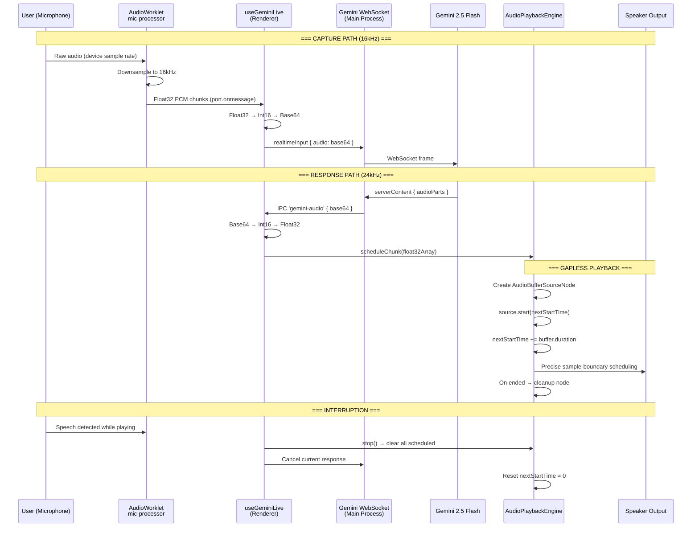

### Audio Format Summary

| Stage | Sample Rate | Bit Depth | Encoding | Buffer Size |
|-------|------------|-----------|----------|-------------|
| Mic capture | Device native | Float32 | PCM | 4096 samples |
| Mic → Gemini | 16,000 Hz | Int16 | Base64 | Variable |
| Gemini → Playback | 24,000 Hz | Int16 | Base64 | Variable |
| Playback scheduling | 24,000 Hz | Float32 | PCM | Per-chunk |

---

## 7. Data Flow: Memory Lifecycle

```mermaid
graph TD
    CONV[Conversation Turn] -->|save_memory tool| STM[Short-Term Buffer<br/>20 entries max<br/>In-memory only]

    STM -->|Session-aware<br/>reinforcement| MTM[Medium-Term Observations<br/>30 entries max<br/>observations.json]

    MTM -->|6-hour consolidation<br/>cycle| CONSOL{Consolidation Engine<br/>Claude Sonnet Analysis}

    CONSOL -->|Weighted scoring:<br/>frequency × 0.3 +<br/>recency × 0.2 +<br/>importance × 0.3 +<br/>cross-ref × 0.2| PROMOTE{Score > threshold?}

    PROMOTE -->|Yes| LTM[Long-Term Memory<br/>Unlimited<br/>memories.json]
    PROMOTE -->|No| DECAY[Stay in MTM<br/>30-day TTL decay]

    CONSOL -->|Claude merges<br/>related facts| MERGE[Merged Memories<br/>Deduplicated + enriched]
    MERGE --> LTM

    LTM -->|On save| EMBED[Semantic Search<br/>Gemini text-embedding-004<br/>768 dimensions]
    LTM -->|If Obsidian configured| OBS[Obsidian Vault<br/>Markdown files<br/>Categorized folders]

    EPIS_SAVE[Session End] -->|Claude Sonnet<br/>summarizes turns| EPIS[Episodic Memory<br/>200 episodes max<br/>episodes.json]
    EPIS --> CONSOL

    REL_UPDATE[Session Events] --> REL[Relationship Memory<br/>Singleton<br/>relationship.json]
    REL -->|Trust: log(sessions)/log(50)<br/>Streak: consecutive days<br/>Inside jokes: extracted| PERSONA[Personality System]

    style STM fill:#0ff,color:#000
    style MTM fill:#818cf8,color:#fff
    style LTM fill:#22c55e,color:#000
    style EPIS fill:#f59e0b,color:#000
    style REL fill:#ec4899,color:#000
```

### Memory Promotion Scoring Formula

```
score = (frequency × 0.3) + (recency × 0.2) + (importance × 0.3) + (crossReference × 0.2)

where:
  frequency   = occurrences / maxOccurrences across all observations
  recency     = 1 - (daysSinceLastSeen / 30)
  importance  = Claude-rated 0-1 during initial save
  crossRef    = number of related memories / total memories (capped at 1)
```

### Consolidation Cycle (6 hours)

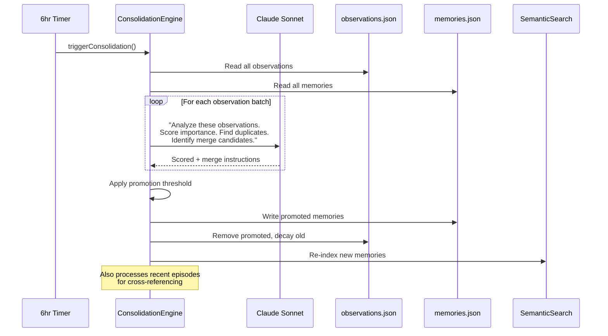

---

## 8. Data Flow: Tool Execution Chain

```mermaid
graph TD
    GEMINI[Gemini Response<br/>toolCall: name + args] --> HOOK[useGeminiLive.ts<br/>handleToolCall()]

    HOOK --> PRIORITY{Tool Routing<br/>Priority Chain}

    PRIORITY -->|1. Specific handlers| SPECIFIC[Built-in Tool Handlers]
    PRIORITY -->|2. browser_* prefix| BROWSER[Browser Connector]
    PRIORITY -->|3. Connector match| CONNECTOR[Connector Registry]
    PRIORITY -->|4. MCP match| MCP_TOOL[MCP Server Tools]
    PRIORITY -->|5. Fallback| DESKTOP[Desktop Tools]

    subgraph "Built-in Tool Handlers"
        SPECIFIC --> SAVE_MEM[save_memory<br/>→ memory:save IPC]
        SPECIFIC --> ASK_CLAUDE[ask_claude<br/>→ server:ask-claude IPC]
        SPECIFIC --> SETUP_INTEL[setup_intelligence<br/>→ intelligence:setup IPC]
        SPECIFIC --> CREATE_TASK[create_task / list_tasks / delete_task<br/>→ scheduler:* IPC]
        SPECIFIC --> READ_SRC[read_own_source / list_own_files<br/>→ Desktop connector]
        SPECIFIC --> PROPOSE[propose_code_change<br/>→ Desktop connector]
        SPECIFIC --> LAUNCH[launch_app<br/>→ desktop:launch IPC]
        SPECIFIC --> FINALIZE[finalize_agent_identity<br/>→ onboarding:finalize IPC]
        SPECIFIC --> INTAKE[save_intake_responses<br/>→ psych:generate IPC]
        SPECIFIC --> FEATURE[mark_feature_setup_step<br/>→ feature-setup:advance IPC]
    end

    subgraph "Browser Tools (browser_* prefix)"
        BROWSER --> NAV[browser_navigate]
        BROWSER --> SCREENSHOT[browser_screenshot]
        BROWSER --> CLICK[browser_click]
        BROWSER --> TYPE[browser_type]
    end

    subgraph "Connector Tools"
        CONNECTOR --> GCAL_T[google-calendar:*]
        CONNECTOR --> GMAIL_T[gmail:*]
        CONNECTOR --> PERP_T[perplexity:*]
        CONNECTOR --> OPENAI_T[openai:*]
    end

    subgraph "MCP Tools (namespaced)"
        MCP_TOOL --> MCP1[serverName::toolName]
    end

    subgraph "Desktop Fallback"
        DESKTOP --> WIN[get_active_window]
        DESKTOP --> LIST_WIN[list_windows]
        DESKTOP --> CMD[run_command]
    end

    SAVE_MEM --> RESULT[Tool Result]
    ASK_CLAUDE --> RESULT
    BROWSER --> RESULT
    CONNECTOR --> RESULT
    MCP_TOOL --> RESULT
    DESKTOP --> RESULT

    RESULT --> GEMINI_RESP[Send toolResponse<br/>back to Gemini]
```

### Tool Declaration Sources

| Source | Count | Registration | Namespace |
|--------|-------|-------------|-----------|
| Built-in tools | ~15 | `tools.ts` `buildToolDeclarations()` | None (flat) |
| Onboarding tools | ~5 | `onboarding.ts` `buildOnboardingToolDeclaration()` | None (flat) |
| Browser connector | 4 | `browser-connector.ts` `TOOLS` | `browser_` prefix |
| Desktop connector | 5 | `desktop-tools.ts` `TOOLS` | None (flat) |
| Google Calendar | 4 | `google-calendar.ts` `TOOLS` | `google-calendar:` |
| Gmail | 5 | `gmail.ts` `TOOLS` | `gmail:` |
| Perplexity | 1 | `perplexity.ts` `TOOLS` | `perplexity:` |
| OpenAI services | 3 | `openai-services.ts` `TOOLS` | `openai:` |
| MCP servers | Dynamic | `mcp-manager.ts` `getAllTools()` | `serverName::` |

---

## 9. Data Flow: Session Management

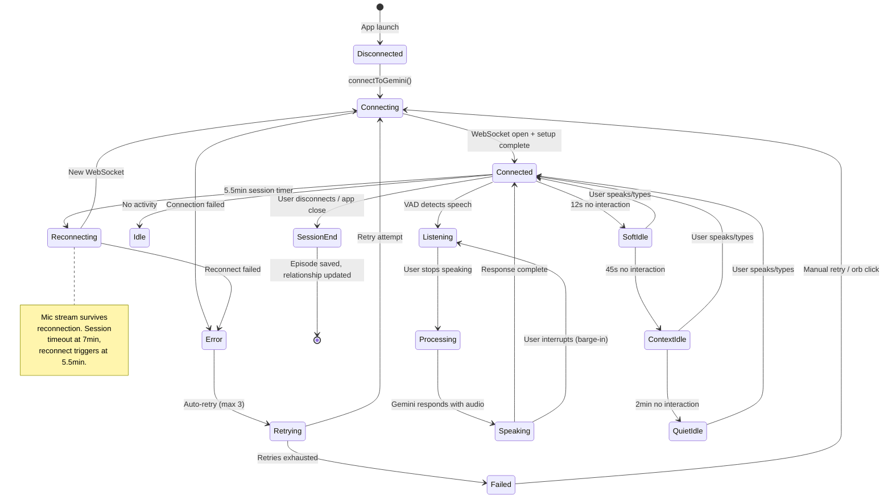

### Session Timing Constants

| Timer | Duration | Trigger | Action |
|-------|----------|---------|--------|
| Soft idle | 12 seconds | No user input | Subtle cue (orb pulse) |
| Context idle | 45 seconds | No user input | Context-aware check-in |
| Quiet idle | 2 minutes | No user input | Quiet companionship mode |
| Session timeout | 7 minutes | Gemini WebSocket TTL | Connection drops |
| Reconnect trigger | 5.5 minutes | Pre-emptive | New WebSocket, mic preserved |
| Consolidation | 6 hours | Timer | Memory promotion cycle |
| Ambient poll | 30 seconds | Timer | Desktop context refresh |
| Sentiment poll | 30 seconds | Timer | Mood classification |
| Intelligence poll | 30 seconds | Timer | Predictive check |

---

## 10. Data Flow: Agent Task Pipeline

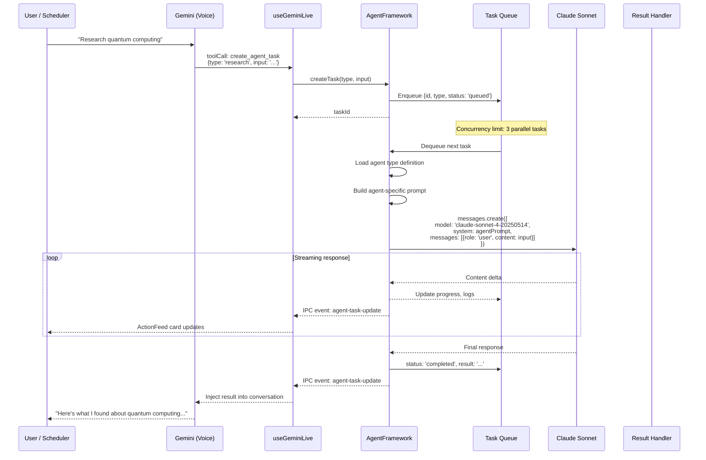

### Agent Type Definitions

| Agent Type | Model | Max Tokens | Temperature | Special Capabilities |
|-----------|-------|------------|-------------|---------------------|
| `research` | Claude Sonnet | 4096 | 0.3 | Multi-step web search via Perplexity, source citations |
| `summarize` | Claude Sonnet | 2048 | 0.2 | Document ingestion, key-point extraction |
| `code-review` | Claude Sonnet | 4096 | 0.1 | File reading, diff analysis, security scanning |
| `draft-email` | Claude Sonnet | 2048 | 0.4 | Tone matching, recipient context, Gmail integration |

---

## 11. Swim Lane: User Interaction Cycle

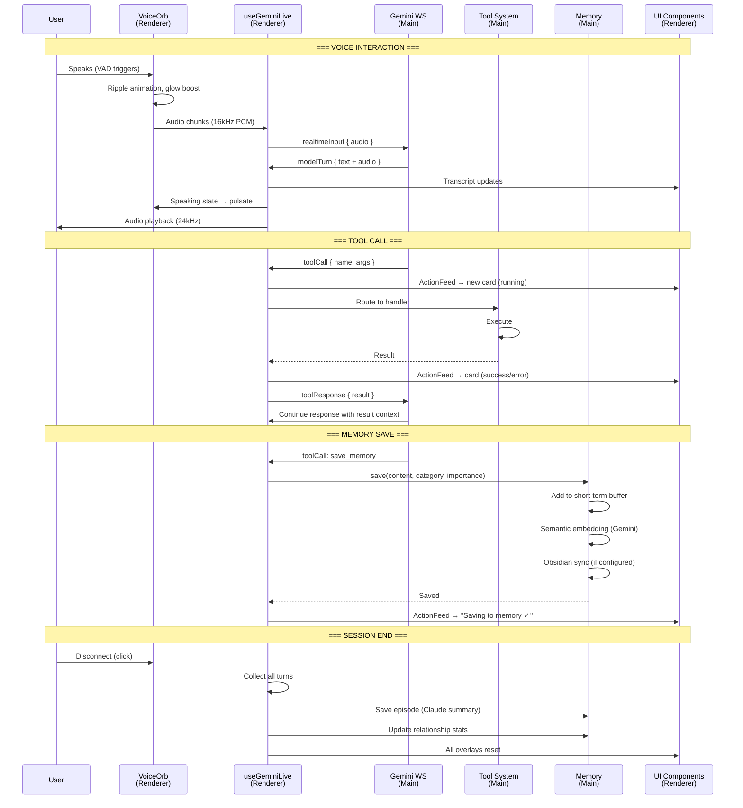

---

## 12. Swim Lane: First-Run Experience

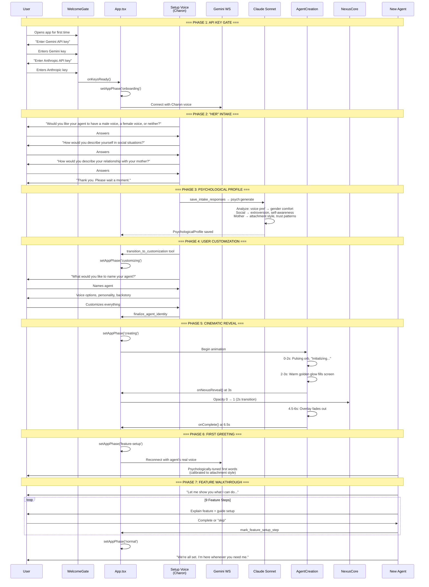

---

## 13. Dependency Graph

### NPM Package Dependencies (Key)

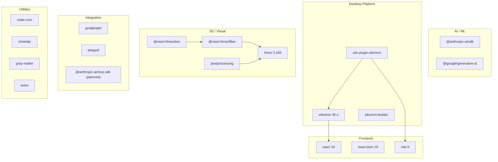

---

## 14. Visual System Architecture

### NexusCore 3D Layer Stack

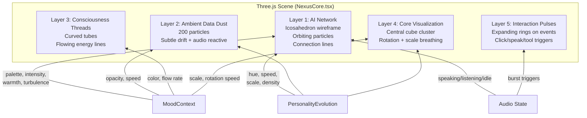

### Mood → Visual Parameter Mapping

| Mood | Palette | Intensity | Warmth | Turbulence |
|------|---------|-----------|--------|------------|
| positive | Green/Cyan | 0.7 | 0.6 | 0.3 |
| excited | Gold/Yellow | 1.0 | 0.8 | 0.7 |
| curious | Purple/Blue | 0.6 | 0.4 | 0.5 |
| focused | Cyan/White | 0.8 | 0.3 | 0.2 |
| neutral | Blue/Grey | 0.4 | 0.3 | 0.2 |
| tired | Dark Purple | 0.3 | 0.5 | 0.1 |
| frustrated | Red/Orange | 0.9 | 0.7 | 0.8 |
| stressed | Red/Dark | 0.8 | 0.2 | 0.9 |

### Color System

| Token | Hex | Usage |
|-------|-----|-------|
| Primary Cyan | `#00f0ff` | Interactive elements, tool actions, focused state |
| Secondary Purple | `#818cf8` / `#a78bfa` | Agent tasks, memory, secondary UI |
| Speaking Gold | `#d4a574` / `#FFD700` | Speaking state, Claude actions, warm accents |
| Success Green | `#22c55e` / `#4ade80` | Completed actions, positive mood |
| Error Red | `#ef4444` / `#f87171` | Errors, frustrated/stressed mood |
| Warning Amber | `#f59e0b` | Agent category, excited mood |
| Background | `#060B19` | Base dark, all surfaces |
| Surface | `rgba(10, 10, 18, 0.85-0.98)` | Cards, overlays, panels |
| Text Primary | `#e0e0e8` | Main text |
| Text Secondary | `#a0a0b8` | Descriptions |
| Text Muted | `#666680` | Hints, metadata |
| Border | `rgba(255, 255, 255, 0.06-0.1)` | Subtle borders |

---

## 15. Security Boundary Map

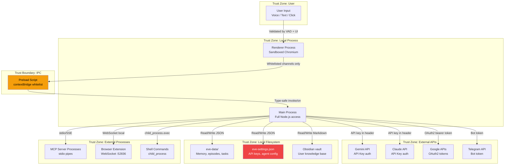

### Security Considerations

| Boundary | Risk | Current Mitigation |
|----------|------|--------------------|
| Preload bridge | Arbitrary IPC | Whitelisted channels in `contextBridge.exposeInMainWorld` |
| Shell execution | Command injection | `run_command` tool — **no sanitization observed** |
| MCP processes | Malicious servers | User-configured only, stdio isolation |
| API keys in settings | Plaintext storage | `eve-settings.json` on local filesystem — **not encrypted** |
| Browser WebSocket | Local network attack | Localhost only (:52836), no auth token |
| Telegram gateway | Message injection | Bot token auth, but messages forwarded to Gemini unsanitized |
| Obsidian sync | Path traversal | Category-based subdirectory mapping, **no path validation observed** |
| OAuth tokens | Token theft | Stored in settings JSON — **not encrypted** |

### Items Flagged for Hardening (Phase 3)

1. **API keys stored in plaintext** — Need encryption at rest (electron safeStorage / keytar)
2. **Shell command execution** — Need command whitelist or sandboxing
3. **Browser WebSocket no auth** — Need shared secret or token validation
4. **Telegram message injection** — Need input sanitization before Gemini injection
5. **Obsidian path traversal** — Need path normalization and jail
6. **OAuth tokens in plaintext** — Need secure credential storage
7. **No CSP headers** — Renderer should have Content Security Policy
8. **Hardcoded user name "Stephen"** — Across 4+ modules, should use settings

---

## Appendix A: File Inventory

### Main Process (`src/main/`)

| File | Lines | Domain | Purpose |
|------|-------|--------|---------|
| `index.ts` | ~600 | Core | Entry point, window creation, IPC hub |
| `server.ts` | ~180 | Core | Anthropic SDK client, Claude API wrapper |
| `gemini-live.ts` | ~350 | Core | Gemini WebSocket manager, audio routing |
| `settings.ts` | ~200 | Core | Persistent JSON settings store |
| `preload.ts` | ~400 | Core | IPC bridge, contextBridge declarations |
| `tools.ts` | ~300 | Core | Gemini tool declarations builder |
| `memory.ts` | ~450 | Memory | 3-tier memory manager |
| `episodic-memory.ts` | ~250 | Memory | Session summarizer via Claude |
| `relationship-memory.ts` | ~200 | Memory | Trust, streaks, inside jokes |
| `memory-consolidation.ts` | ~300 | Memory | 6hr promotion engine |
| `semantic-search.ts` | ~200 | Memory | Gemini embeddings, cosine similarity |
| `obsidian-sync.ts` | ~250 | Memory | Bidirectional vault mirroring |
| `ambient.ts` | ~200 | Intelligence | 30s polling desktop context |
| `sentiment.ts` | ~150 | Intelligence | Mood classification |
| `predictive-intelligence.ts` | ~350 | Intelligence | Briefings, check-ins, emotional support |
| `world-monitor.ts` | ~250 | Intelligence | News, weather, stocks feeds |
| `agent-framework.ts` | ~300 | Agents | Task queue, execution, concurrency |
| `agents/research.ts` | ~150 | Agents | Research agent definition |
| `agents/summarize.ts` | ~120 | Agents | Summarize agent definition |
| `agents/code-review.ts` | ~150 | Agents | Code review agent definition |
| `agents/draft-email.ts` | ~130 | Agents | Email drafting agent definition |
| `agents/index.ts` | ~30 | Agents | Agent type registry |
| `agents/types.ts` | ~50 | Agents | Shared agent types |
| `personality.ts` | ~250 | Identity | System prompt builder, personality config |
| `onboarding.ts` | ~400 | Identity | First-run flow, "Her" screenplay |
| `psychological-profile.ts` | ~200 | Identity | Claude psych analysis |
| `feature-setup.ts` | ~250 | Identity | 9-step guided setup |
| `personality-evolution.ts` | ~150 | Identity | Trait → visual mapping |
| `task-scheduler.ts` | ~250 | Scheduling | Persistent cron tasks |
| `clipboard-monitor.ts` | ~80 | Infrastructure | Polling clipboard changes |
| `session-health.ts` | ~120 | Infrastructure | Uptime, error tracking |
| `desktop-tools.ts` | ~200 | Connectors | Window, app, clipboard tools |
| `browser-connector.ts` | ~300 | Connectors | WebSocket browser extension bridge |
| `google-calendar.ts` | ~350 | Connectors | OAuth2 calendar CRUD |
| `gmail.ts` | ~400 | Connectors | OAuth2 email CRUD |
| `mcp-manager.ts` | ~400 | Connectors | Multi-server MCP protocol |
| `telegram-gateway.ts` | ~250 | Gateway | Bot API message bridge |
| `perplexity.ts` | ~150 | Services | Web search with citations |
| `openai-services.ts` | ~200 | Services | DALL-E, TTS, GPT |

### Renderer (`src/renderer/`)

| File | Lines | Layer | Purpose |
|------|-------|-------|---------|
| `App.tsx` | ~500 | Shell | State machine, phase routing, keyboard shortcuts |
| `main.tsx` | ~10 | Entry | React DOM root |
| `hooks/useGeminiLive.ts` | ~2100 | Hook | Complete Gemini integration, tool routing, audio |
| `hooks/useWakeWord.ts` | ~150 | Hook | "Hey Friday" wake word detection |
| `components/NexusCore.tsx` | ~800 | 3D | Three.js 5-layer visualization |
| `components/VoiceOrb.tsx` | ~400 | UI | Central interaction orb |
| `components/WireframeNetwork.tsx` | ~600 | Canvas | 2D particle network (primary BG) |
| `components/ParticleBackground.tsx` | ~160 | Canvas | 2D particles (fallback BG) |
| `components/ChatHistory.tsx` | ~300 | UI | Conversation display |
| `components/TextInput.tsx` | ~200 | UI | Text message entry |
| `components/Settings.tsx` | ~500 | UI | Configuration panel |
| `components/StatusBar.tsx` | ~200 | UI | Bottom status strip |
| `components/ActionFeed.tsx` | ~350 | UI | Tool/agent activity ticker |
| `components/Dashboard.tsx` | ~500 | UI | Command center overlay |
| `components/AgentDashboard.tsx` | ~525 | UI | Agent task monitor |
| `components/MemoryExplorer.tsx` | ~730 | UI | Memory browser |
| `components/QuickActions.tsx` | ~435 | UI | Command palette |
| `components/ConnectionOverlay.tsx` | ~250 | UI | Error recovery overlay |
| `components/AgentCreation.tsx` | ~350 | UI | Cinematic agent reveal |
| `components/WelcomeGate.tsx` | ~200 | UI | API key entry gate |
| `components/MoodContext.tsx` | ~200 | Context | Mood state provider |
| `components/ErrorBoundary.tsx` | ~195 | Infra | Crash recovery |
| `components/dashboard/ContextCard.tsx` | ~315 | Sub | Live ambient context |
| `components/dashboard/AgentCard.tsx` | ~240 | Sub | Agent summary card |
| `components/dashboard/MoodTimeline.tsx` | ~300 | Sub | SVG mood chart |
| `AudioPlaybackEngine.ts` | ~200 | Audio | Gapless Web Audio scheduling |
| `sound-effects.ts` | ~100 | Audio | Sound effect registry |
| `SessionManager.ts` | ~250 | Infra | 7min timeout, reconnect logic |
| `IdleBehavior.ts` | ~200 | Infra | Tiered idle state machine |

### Total: ~90 source files, ~15,000+ lines of TypeScript

---

## Appendix B: Data File Locations

| File | Format | Size Limit | Purpose |
|------|--------|-----------|---------|
| `eve-data/memories.json` | JSON array | Unlimited | Long-term memory store |
| `eve-data/observations.json` | JSON array | 30 entries | Medium-term observations |
| `eve-data/episodes.json` | JSON array | 200 entries | Session summaries |
| `eve-data/relationship.json` | JSON object | Singleton | Trust, streaks, inside jokes |
| `eve-data/scheduled-tasks.json` | JSON array | Unlimited | Cron task definitions |
| `eve-data/intelligence-topics.json` | JSON array | Unlimited | Research topic configs |
| `eve-data/intelligence-cache.json` | JSON object | Per-topic | Cached research results |
| `eve-settings.json` | JSON object | Singleton | All settings, API keys, agent config |

---

*This is a living document. Update as the architecture evolves.*
