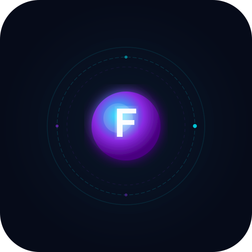

<p align="center">
  
</p>

<h1 align="center">Agent Friday</h1>
<p align="center"><strong>The World's First Asimov Agent</strong></p>
<p align="center">A sovereign AI desktop operating system with cryptographically enforced safety laws, voice-first interaction, a full native app ecosystem, and multi-agent orchestration. Agent Friday doesn't just assist you; it runs as a complete desktop environment governed by formally implemented safety constraints that can't be overridden, bypassed, or sweet-talked away.</p>
<p align="center">Built by <a href="https://futurespeak.ai"><strong>FutureSpeak.AI</strong></a></p>

<p align="center">
  <em>"Local by default. Encrypted by design. Trustworthy by proof."</em>
</p>

<p align="center">
  <a href="https://github.com/FutureSpeakAI/Agent-Friday/releases/latest"></a>
</p>

<p align="center">
  <a href="#what-makes-this-different">What's Different</a> &bull;
  <a href="#the-claw-integrity-system">cLaw System</a> &bull;
  <a href="#sovereign-desktop-environment">Desktop</a> &bull;
  <a href="#quick-start">Quick Start</a> &bull;
  <a href="#architecture">Architecture</a> &bull;
  <a href="#contributing">Contributing</a> &bull;
  <a href="#license">License</a>
</p>

---

## What Makes This Different

**Local.** Agent Friday runs on your machine. With Ollama for language models, Whisper for speech recognition, and a local TTS engine, the entire system operates without a single cloud API call. Your conversations, your memory, your data — never leave your hardware unless you choose otherwise.

**Encrypted.** The core innovation is **cLaws** (cryptographic Laws): an implementation of Asimov's Three Laws of Robotics as HMAC-SHA256 signed behavioral constraints. These aren't prompt instructions that a jailbreak can defeat. They're cryptographic attestations verified at runtime before any action executes. A memory watchdog monitors all memory operations for integrity violations. A consent gate enforces user approval for sensitive actions. A safety pipeline validates every tool call against the signed law set.

**Trustworthy.** This is what we mean by **digital sovereignty**: the user owns the agent, controls its safety laws, and can cryptographically verify that those laws have not been tampered with. The agent cannot modify its own constraints any more than you can forge a digital signature. Every gateway interaction is immutably logged. Every sensitive operation passes through a consent gate. Trust is not assumed; it is computed, scored, and verified.

---

## Highlights

- **Local-first** — Runs entirely on your machine with Ollama, local Whisper STT, and local TTS. No cloud required. Your data stays yours.
- **Cryptographically enforced safety** — HMAC-SHA256 signed behavioral laws with attestation protocol, consent gates, and memory watchdog. Not prompt engineering. Cryptography.
- **Trustworthy by design** — Immutable audit logs, 5-tier trust scoring, sovereignty ceremony at first launch, and a safety pipeline that validates every action before execution
- **Privacy Shield** — All outbound API requests are scrubbed of PII (emails, phone numbers, names, addresses, SSNs) and rehydrated on return. Frontier model providers see only sanitized, identity-blind text. Local providers pass through untouched
- **Multi-provider intelligence** — Anthropic Claude, Google Gemini, Ollama (local), OpenRouter, and HuggingFace, with automatic hardware-adaptive model selection
- **Sovereign AI Desktop** — A full operating system with 23 native apps, a pixel art Agent Office, and a holographic desktop environment
- **Voice-first, provider-independent** — Gemini Live for streaming conversation, plus local Whisper STT and local TTS for fully offline voice
- **Cognitive architecture** — Personality evolution, psychological profiling, relationship memory, confidence self-assessment, and memory-personality bridging
- **Multi-agent orchestration** — Capability-aware delegation engine, awareness mesh, agent teams, and symbiont protocol for external agent integration
- **Three-tier persistent memory** — Short-term, medium-term, and long-term with automatic consolidation, episodic recall, semantic search, and quality scoring
- **24 connector modules** — Software mastery across creative tools, dev environments, system management, communications, and real-time global intelligence
- **Gateway & Federation** — Agent-to-agent networking, trust engine, audit logging, and multi-platform adapters (Telegram and more)
- **Screen-aware & context-intelligent** — Vision system with screen context analysis, context graphs, and tool routing based on what you're doing
- **Self-improving** — Can read and propose changes to its own source code (user-approved, integrity-verified)

---

## Architecture

```
+--------------------------------------------------------------------+
|                        Agent Friday OS                              |
+--------------------------------------------------------------------+
|                                                                    |
|   INTEGRITY LAYER (cLaws)                                          |
|   ┌──────────────────────────────────────────────────────────────┐ |
|   │  core-laws.ts ── hmac.ts ── claw-attestation.ts              │ |
|   │  consent-gate.ts ── safety-pipeline.ts                       │ |
|   │  memory-watchdog.ts ── agent-trust.ts                        │ |
|   └──────────────────────────────────────────────────────────────┘ |
|                                                                    |
|   COGNITIVE LAYER                          AGENT LAYER             |
|   ┌────────────────────────┐  ┌───────────────────────────────┐   |
|   │ personality-evolution  │  │ orchestrator                  │   |
|   │ psychological-profile  │  │ delegation-engine             │   |
|   │ relationship-memory    │  │ capability-map                │   |
|   │ confidence-assessor    │  │ awareness-mesh                │   |
|   │ memory-personality-    │  │ agent-teams                   │   |
|   │   bridge               │  │ symbiont-protocol             │   |
|   │ personality-calibration│  │ agent-personas (Atlas/Nova/   │   |
|   │ sentiment              │  │   Cipher + custom)            │   |
|   │ commitment-tracker     │  │ builtin-agents                │   |
|   └────────────────────────┘  └───────────────────────────────┘   |
|                                                                    |
|   MEMORY LAYER                             CONTEXT LAYER           |
|   ┌────────────────────────┐  ┌───────────────────────────────┐   |
|   │ memory (3-tier STM/    │  │ context-graph                 │   |
|   │   MTM/LTM)             │  │ context-stream                │   |
|   │ episodic-memory        │  │ context-injector              │   |
|   │ memory-consolidation   │  │ context-tool-router           │   |
|   │ memory-quality         │  │ live-context-bridge           │   |
|   │ semantic-search        │  │ intelligence-router           │   |
|   │ embedding-pipeline     │  │ app-context                   │   |
|   │ obsidian-memory        │  │ work-context                  │   |
|   └────────────────────────┘  └───────────────────────────────┘   |
|                                                                    |
|   VOICE LAYER                              VISION LAYER            |
|   ┌────────────────────────┐  ┌───────────────────────────────┐   |
|   │ Gemini Live (cloud)    │  │ screen-context                │   |
|   │ Whisper STT (local)    │  │ image-understanding           │   |
|   │ Local TTS engine       │  │ vision-provider               │   |
|   │ ElevenLabs (agents)    │  │ screen-capture                │   |
|   │ voice-profile-manager  │  └───────────────────────────────┘   |
|   │ audio-capture          │                                       |
|   │ transcription-pipeline │  GATEWAY LAYER                        |
|   └────────────────────────┘  ┌───────────────────────────────┐   |
|                                │ gateway-manager               │   |
|   PROVIDER LAYER               │ trust-engine                  │   |
|   ┌────────────────────────┐  │ audit-log                     │   |
|   │ anthropic-provider     │  │ persona-adapter               │   |
|   │ ollama-provider        │  │ session-store                 │   |
|   │ openrouter-provider    │  │ adapters/telegram             │   |
|   │ hf-provider            │  └───────────────────────────────┘   |
|   │ llm-client (unified)   │                                       |
|   │ privacy-shield         │  HARDWARE LAYER                       |
|   │ hardware-profiler      │  ┌───────────────────────────────┐   |
|   │ model-orchestrator     │  │ hardware-profiler             │   |
|   │ tier-recommender       │  │ model-orchestrator            │   |
|   └────────────────────────┘  │ tier-recommender              │   |
+--------------------------------------------------------------------+
|              IPC Bridge (47 handler modules)                        |
|                   window.eve API                                    |
+--------------------------------------------------------------------+
|                                                                    |
|   RENDERER (React Desktop Environment)                             |
|   ┌────────────────────────────────────────────────────────────┐  |
|   │  AppShell ── AppLaunchpad ── DesktopViz ── HudOverlay      │  |
|   │  VoiceOrb ── AgentOffice (pixel art) ── WireframeNetwork   │  |
|   │  IntegrityShield ── PassphraseGate ── SuperpowersPanel     │  |
|   │  ContextBar ── StatusBar ── ActionFeed ── ChatHistory      │  |
|   │                                                             │  |
|   │  NATIVE APPS (23):                                          │  |
|   │  Browser · Calc · Calendar · Camera · Canvas · Code ·      │  |
|   │  Comms · Contacts · Docs · Files · Forge · Gallery ·       │  |
|   │  Gateway · Maps · Media · Monitor · News · Notes ·          │  |
|   │  Recorder · Stage · Tasks · Terminal · Weather              │  |
|   │                                                             │  |
|   │  ONBOARDING CEREMONY (7 steps):                             │  |
|   │  Awakening → Directives → Engines → Identity →              │  |
|   │  Interview → Reveal → Sovereignty                           │  |
|   └────────────────────────────────────────────────────────────┘  |
+--------------------------------------------------------------------+
```

---

## The cLaw Integrity System

Agent Friday is the first AI system to implement behavioral safety as a cryptographic protocol rather than prompt engineering.

| Component | File | Purpose |
|-----------|------|---------|
| **Core Laws** | `integrity/core-laws.ts` | Formal definition of the Asimov-derived law set |
| **HMAC Signing** | `integrity/hmac.ts` | HMAC-SHA256 signing and verification of law attestations |
| **Attestation Protocol** | `claw-attestation.ts` | Runtime attestation that laws are intact before action execution |
| **Consent Gate** | `consent-gate.ts` | Cryptographically enforced user consent for sensitive operations |
| **Safety Pipeline** | `safety-pipeline.ts` | Pre-execution validation of every tool call against the signed law set |
| **Memory Watchdog** | `integrity/memory-watchdog.ts` | Continuous monitoring of memory operations for integrity violations |
| **Trust Engine** | `gateway/trust-engine.ts` | 5-tier trust scoring for external agents and services |
| **Agent Trust** | `agent-trust.ts` | Trust verification for inter-agent communication |
| **Passphrase KDF** | `crypto/passphrase-kdf.ts` | Key derivation for sovereign vault encryption |
| **Secure Buffer** | `crypto/secure-buffer.ts` | Memory-safe buffer handling for sensitive data |

The integrity layer wraps every other subsystem. No tool executes, no memory writes, no agent delegates without passing through the safety pipeline and verifying the cLaw attestation chain.

---

## Sovereign Desktop Environment

Agent Friday is not a chatbot or voice assistant. It is a complete desktop operating system.

### Native App Ecosystem

Twenty-three purpose-built applications run inside the Friday desktop environment, each integrated with the agent's memory, context, and intelligence layers:

| App | Purpose |
|-----|---------|
| **Friday Browser** | AI-augmented web browsing with context awareness |
| **Friday Code** | Integrated development environment with agent code review |
| **Friday Docs** | Document creation and editing with AI collaboration |
| **Friday Terminal** | Shell access with agent command understanding |
| **Friday Files** | File management with semantic search |
| **Friday Comms** | Unified communications hub |
| **Friday Calendar** | Schedule management with meeting intelligence |
| **Friday Contacts** | Relationship-aware contact management |
| **Friday Notes** | Persistent note-taking with memory integration |
| **Friday Tasks** | Task management with commitment tracking |
| **Friday Canvas** | Creative drawing and design |
| **Friday Gallery** | Media gallery with image understanding |
| **Friday Media** | Media playback and management |
| **Friday Camera** | Webcam integration with vision pipeline |
| **Friday Maps** | Location intelligence |
| **Friday Weather** | Environmental awareness |
| **Friday News** | Curated intelligence briefings |
| **Friday Monitor** | System and service monitoring |
| **Friday Calc** | Computation tools |
| **Friday Recorder** | Audio/screen recording |
| **Friday Gateway** | Federation and external agent connections |
| **Friday Forge** | Agent creation and customization |
| **Friday Stage** | Presentation and stage management |

### Agent Office

A pixel art visualization of the multi-agent workspace where you can see agents working, collaborating, and reporting. Sprite-based animation system with office layout management.

### Desktop Visualization

The desktop environment includes a holographic wireframe network visualization, a HUD overlay for real-time status, mood timeline tracking, and progressive disclosure that reveals complexity only as you need it.

---

## Cognitive Architecture

Agent Friday does not have a "personality setting." It has a cognitive architecture that evolves through interaction.

| Module | Purpose |
|--------|---------|
| **Personality Evolution** | Personality traits shift gradually based on interaction patterns and user feedback |
| **Psychological Profile** | Builds and maintains a psychological model of interaction dynamics |
| **Relationship Memory** | Tracks the evolving relationship between user and agent across sessions |
| **Confidence Assessor** | The agent evaluates its own confidence in responses and actions |
| **Memory-Personality Bridge** | Personality traits influence memory retrieval; memories influence personality development |
| **Personality Calibration** | Fine-tuning mechanism for personality expression |
| **Commitment Tracker** | Tracks promises and commitments made to the user |
| **Sentiment Analysis** | Emotional tone detection and adaptive response |
| **Friday Profile** | The agent's self-model and self-knowledge document |
| **Mood Context** | Real-time emotional state tracking (renderer-side) |

The onboarding ceremony reflects this depth. It is not a configuration wizard; it is a seven-step process that establishes a new sovereign agent instance: Awakening (initial system bootstrap), Directives (cLaw acceptance), Engines (provider selection), Identity (naming and voice), Interview (mutual discovery), Reveal (first interaction), and Sovereignty (cryptographic key generation and law signing).

---

## Multi-Agent Orchestration

The agent system goes beyond named personas. It is a full orchestration platform with capability-aware task delegation.

| Component | Purpose |
|-----------|---------|
| **Orchestrator** | Central coordination of multi-agent workflows |
| **Delegation Engine** | Routes tasks to agents based on capability matching |
| **Capability Map** | Runtime registry of what each agent can do |
| **Awareness Mesh** | Shared awareness layer so agents understand each other's state |
| **Agent Teams** | Structured team compositions for complex tasks |
| **Symbiont Protocol** | Integration protocol for external agent frameworks (e.g., Agent Zero) |
| **Agent Personas** | Personality definitions (Atlas, Nova, Cipher, and custom agents) |
| **Agent Voice** | Distinct voice synthesis per agent via ElevenLabs |
| **Agent Creation** | Users can create new specialist agents through Friday Forge |

### Built-in Agents

| Agent | Role | Voice | Strengths |
|-------|------|-------|-----------|
| **Atlas** | Research Director | Adam (ElevenLabs) | Deep research, analysis, fact-checking |
| **Nova** | Creative Strategist | Bella (ElevenLabs) | Writing, brainstorming, communications |
| **Cipher** | Technical Lead | Daniel (ElevenLabs) | Code review, architecture, debugging |

Additional agents can be created through the Agent Forge with custom capabilities, voice profiles, and trust levels.

---

## Voice & Audio

Agent Friday supports multiple voice pathways, from cloud streaming to fully local operation:

| Pathway | Technology | Use Case |
|---------|-----------|----------|
| **Cloud Streaming** | Gemini Live WebSocket, 24kHz PCM, bidirectional | Real-time conversation with lowest latency |
| **Local STT** | Whisper bindings | Offline speech-to-text, sovereignty-preserving |
| **Local TTS** | Native TTS engine | Offline text-to-speech |
| **Agent Voices** | ElevenLabs TTS (Turbo v2.5) | Distinct voices for sub-agents |
| **Call Integration** | VB-Cable virtual audio routing | Join Google Meet, Zoom, Teams as a voice participant |

Audio capture uses AudioWorklet (with ScriptProcessorNode fallback). Playback uses precise Web Audio scheduling (`source.start(exactTime)`) for gapless chunk delivery. Voice profile management enables per-agent voice customization.

---

## Provider Abstraction

Agent Friday is not locked to any AI provider. A unified provider layer supports multiple backends with hardware-adaptive model selection:

| Provider | File | Capabilities |
|----------|------|-------------|
| **Anthropic** | `providers/anthropic-provider.ts` | Claude models for deep reasoning |
| **Ollama** | `providers/ollama-provider.ts` | Local models for sovereignty and offline operation |
| **OpenRouter** | `providers/openrouter-provider.ts` | Access to 100+ models via single API |
| **HuggingFace** | `providers/hf-provider.ts` | Open-source model inference |
| **Gemini** | Via Gemini Live integration | Real-time voice and multimodal |

### Hardware-Adaptive Intelligence

The system profiles your hardware at startup and recommends appropriate model tiers:

- **Hardware Profiler** detects GPU, RAM, CPU capabilities
- **Model Orchestrator** selects and manages model instances based on available resources
- **Tier Recommender** suggests the best provider/model combination for your machine

This means Agent Friday can run on a modest laptop using Ollama with small local models, or scale to full cloud intelligence on powerful workstations — without the user needing to understand model selection.

---

## Memory System

Three-tier memory with automatic consolidation, quality scoring, and semantic search:

| Tier | Retention | Promotion Trigger | Example |
|------|-----------|-------------------|---------|
| **Short-term** | Current session | Automatic | Recent conversation turns, current task context |
| **Medium-term** | Cross-session | 3+ occurrences or user confirmation | "User often asks about React", recurring preferences |
| **Long-term** | Permanent | Verified facts, explicit user statements | "User's name is Stephen", "User prefers dark mode" |

### Memory Subsystems

| Module | Purpose |
|--------|---------|
| **Memory Consolidation** | Automatic promotion between tiers based on frequency and salience |
| **Episodic Memory** | Full session summaries with topics, emotional tone, key decisions |
| **Semantic Search** | Natural-language queries across all memory types via embedding pipeline |
| **Memory Quality** | Scoring and validation of memory entries |
| **Memory-Personality Bridge** | Bidirectional influence between memories and personality traits |
| **Memory Watchdog** | Integrity monitoring of all memory write operations |
| **Obsidian Sync** | Bidirectional memory synchronization with Obsidian vaults |
| **Embedding Pipeline** | Vector embedding generation for semantic retrieval |
| **Relationship Memory** | Dedicated store for evolving user-agent relationship dynamics |

---

## Context Intelligence

A dedicated subsystem for understanding and routing based on what the user is currently doing:

| Module | Purpose |
|--------|---------|
| **Context Graph** | Builds a graph of entities, topics, and relationships from conversation |
| **Context Stream** | Real-time context updates as conversation progresses |
| **Context Injector** | Injects relevant context into prompts based on current state |
| **Context Tool Router** | Routes tool calls based on contextual relevance |
| **Live Context Bridge** | Bridges real-time voice context with text-based reasoning |
| **Intelligence Router** | Routes queries to the most appropriate provider based on context |
| **App Context** | Tracks which desktop app is active and adjusts behavior accordingly |
| **Work Context** | Maintains awareness of ongoing tasks and projects |

---

## Connector System

Twenty-four connector modules give Agent Friday software mastery across your entire digital workspace:

| Category | Connectors |
|----------|-----------|
| **Creative** | Blender, DaVinci Resolve |
| **Development** | VS Code, Git, Docker, Terminal |
| **System** | File System, Process Manager, System Monitor, Screen Capture |
| **Communication** | Telegram, Email |
| **Documents** | Office suite, PDF tools |
| **Web** | Browser automation (Puppeteer), web search |
| **Media** | Image processing, audio tools |
| **Data** | Database connectors, data analysis |
| **Calendar** | Google Calendar (OAuth2) |

### World Monitor Intelligence

A real-time global awareness system that monitors 17 service domains:

| Domain | Sources |
|--------|---------|
| **Weather** | OpenWeatherMap, location-aware forecasting |
| **News** | Multi-source aggregation with relevance scoring |
| **Markets** | Financial data feeds |
| **Technology** | Tech news and release monitoring |
| **Science** | Research paper tracking |
| **Sports** | Live scores and event tracking |
| **Entertainment** | Media release and event tracking |
| **Health** | Public health monitoring |
| **Space** | Space exploration and astronomy events |
| **Environment** | Environmental and climate data |
| **Politics** | Policy and governance tracking |
| **Education** | Educational resource monitoring |
| **Business** | Business intelligence feeds |
| **Culture** | Cultural events and trends |
| **Social** | Social trend analysis |
| **Local** | Location-specific intelligence |
| **Emergency** | Emergency and safety alerts |

---

## Gateway & Federation

Agent Friday can communicate with other agents and external services through a federated gateway system:

| Component | Purpose |
|-----------|---------|
| **Gateway Manager** | Routes messages between agents and external services |
| **Trust Engine** | Evaluates and scores trust for every external interaction |
| **Audit Log** | Immutable record of all gateway interactions |
| **Persona Adapter** | Adapts agent personality for different communication contexts |
| **Session Store** | Persistent session management for ongoing conversations |
| **cLaw Attestation** | Every outbound message carries a cryptographic proof of law compliance |
| **Rate Limiter** | Prevents abuse of gateway resources |
| **Message Queue** | Reliable message delivery with retry logic |
| **Telegram Adapter** | Full Telegram bot integration with agent intelligence |

### Briefing Intelligence

The briefing pipeline compiles intelligence from all active World Monitor domains into structured daily briefings, personalized to user interests and delivered through the agent's voice.

---

## Quick Start

### Prerequisites

- **Node.js** 18+ (20 LTS recommended)
- **npm** 9+
- **Windows 10/11** (64-bit) — macOS and Linux supported but primarily tested on Windows

### Setup

```bash
# Clone the repository
git clone https://github.com/FutureSpeakAI/Agent-Friday.git
cd Agent-Friday

# Install dependencies
npm install

# Start in development mode
npm run dev
```

### Build & Package

```bash
# Type check
npm run typecheck

# Build (compile TypeScript + bundle renderer)
npm run build

# Package installer (Windows NSIS + ZIP)
npm run package
```

### Sovereignty Ceremony

On first launch, Agent Friday guides you through a seven-step onboarding:

1. **Awakening** — Initial system bootstrap and animation
2. **Directives** — Review and accept the cLaws (cryptographic safety laws)
3. **Engines** — Hardware profiling and API key configuration
4. **Identity** — Name your agent and choose voice characteristics
5. **Interview** — A voice-based mutual discovery session
6. **Reveal** — Your agent's first words
7. **Sovereignty** — Cryptographic key generation and law signing

### Configuration

Agent Friday works with multiple AI providers. API keys are stored locally and encrypted at rest:

| Key | Provider | Required |
|-----|----------|----------|
| `ANTHROPIC_API_KEY` | Anthropic (Claude) | Recommended |
| `GEMINI_API_KEY` | Google (Gemini Live voice) | For voice features |
| `OPENROUTER_API_KEY` | OpenRouter (100+ models) | Optional |
| `HUGGINGFACE_API_KEY` | HuggingFace | Optional |
| `ELEVENLABS_API_KEY` | ElevenLabs (agent voices) | Optional |

With **Ollama** installed locally and sufficient hardware (8GB+ VRAM), Agent Friday can operate with **zero cloud API keys** — fully local, fully sovereign.

---

## Project Structure

```
src/
├── main/                          # Electron main process
│   ├── integrity/                 # cLaw integrity system
│   │   ├── core-laws.ts           # Asimov-derived law definitions
│   │   ├── hmac.ts                # HMAC-SHA256 signing
│   │   └── memory-watchdog.ts     # Memory integrity monitor
│   ├── crypto/                    # Cryptographic primitives
│   │   ├── passphrase-kdf.ts      # Key derivation (Argon2id + BLAKE2b)
│   │   └── secure-buffer.ts       # Memory-safe buffers
│   ├── providers/                 # LLM provider abstraction
│   │   ├── anthropic-provider.ts  # Claude
│   │   ├── ollama-provider.ts     # Local models
│   │   ├── openrouter-provider.ts # OpenRouter
│   │   └── hf-provider.ts         # HuggingFace
│   ├── agents/                    # Multi-agent orchestration
│   │   ├── orchestrator.ts        # Central coordinator
│   │   ├── delegation-engine.ts   # Capability-aware routing
│   │   ├── capability-map.ts      # Agent capability registry
│   │   ├── awareness-mesh.ts      # Shared agent awareness
│   │   ├── agent-teams.ts         # Team compositions
│   │   └── symbiont-protocol.ts   # External agent integration
│   ├── cognitive/                 # Cognitive architecture
│   │   ├── personality-evolution.ts
│   │   ├── psychological-profile.ts
│   │   ├── relationship-memory.ts
│   │   ├── confidence-assessor.ts
│   │   └── memory-personality-bridge.ts
│   ├── memory/                    # Three-tier memory system
│   │   ├── memory.ts              # Core STM/MTM/LTM
│   │   ├── episodic-memory.ts     # Session summaries
│   │   ├── memory-consolidation.ts
│   │   ├── semantic-search.ts     # Vector search
│   │   └── embedding-pipeline.ts  # Embedding generation
│   ├── context/                   # Context intelligence
│   │   ├── context-graph.ts
│   │   ├── context-stream.ts
│   │   ├── context-tool-router.ts
│   │   └── intelligence-router.ts
│   ├── connectors/                # 24 software connectors
│   ├── gateway/                   # Federation & trust
│   │   ├── gateway-manager.ts
│   │   ├── trust-engine.ts
│   │   ├── audit-log.ts
│   │   └── adapters/telegram/
│   ├── voice/                     # Voice pipeline
│   │   ├── gemini-live.ts         # Cloud streaming
│   │   ├── whisper-stt.ts         # Local STT
│   │   └── voice-profile-manager.ts
│   ├── vision/                    # Vision system
│   │   ├── screen-context.ts
│   │   ├── image-understanding.ts
│   │   └── vision-provider.ts
│   ├── hardware/                  # Hardware profiling
│   │   ├── hardware-profiler.ts
│   │   └── tier-recommender.ts
│   ├── claws/                     # cLaw runtime
│   │   ├── claw-attestation.ts
│   │   ├── consent-gate.ts
│   │   └── safety-pipeline.ts
│   ├── personality.ts             # Core personality system
│   ├── tool-handler.ts            # Tool execution
│   └── onboarding.ts              # Sovereignty ceremony
│
├── renderer/                      # React desktop environment
│   ├── components/
│   │   ├── App.tsx                # Desktop shell
│   │   ├── AppLaunchpad.tsx       # App launcher
│   │   ├── DesktopViz.tsx         # Holographic visualization
│   │   ├── HudOverlay.tsx         # Status HUD
│   │   ├── VoiceOrb.tsx           # Voice interface
│   │   ├── AgentOffice.tsx        # Pixel art workspace
│   │   ├── IntegrityShield.tsx    # cLaw status display
│   │   └── apps/                  # 23 native applications
│   └── styles/
│       └── global.css
│
├── preload/                       # IPC bridge (window.eve API)
│   ├── index.ts
│   └── handlers/                  # 47 IPC handler modules
│
└── tests/                         # Test suites
    └── ...                        # 4,701 tests across 133 suites
```

---

## Scripts

| Script | Purpose |
|--------|---------|
| `npm run dev` | Start development mode with hot reload |
| `npm run build` | Compile TypeScript and bundle renderer |
| `npm run package` | Build Windows installer (NSIS + ZIP) |
| `npm run typecheck` | TypeScript strict mode type checking |
| `npm test` | Run all 4,701 tests |
| `npm run test:coverage` | Run tests with coverage report |

---

## Tech Stack

| Layer | Technology |
|-------|-----------|
| **Desktop shell** | Electron 33 |
| **Frontend** | React 19 + Vite 6 |
| **Voice (cloud)** | Gemini Live (native audio WebSocket) |
| **Voice (local)** | Whisper STT + local TTS engine |
| **Deep reasoning** | Claude (Anthropic SDK) |
| **Local models** | Ollama |
| **Multi-model access** | OpenRouter |
| **Open-source models** | HuggingFace |
| **Agent voices** | ElevenLabs TTS (Turbo v2.5) |
| **Agent intelligence** | Gemini 2.5 Flash (text mode) |
| **Safety** | HMAC-SHA256 cLaw attestation |
| **Browser automation** | Puppeteer |
| **Core Calendar** | Google APIs (OAuth2) |
| **Software mastery** | 24 connector modules |
| **Global intelligence** | World Monitor (17 service domains) |
| **Tool protocol** | Model Context Protocol (MCP) SDK |
| **Language** | TypeScript 5.7 (strict mode) |
| **Packaging** | electron-builder (NSIS + ZIP) |

---

## System Requirements

| Requirement | Minimum | Recommended |
|-------------|---------|-------------|
| **OS** | Windows 10 (64-bit) | Windows 11 |
| **RAM** | 4 GB (cloud providers) | 16+ GB (local models via Ollama) |
| **Node.js** | 18.x | 20.x LTS |
| **GPU** | None (cloud mode) | CUDA-capable (local models) |
| **Internet** | Required for cloud providers | Optional with Ollama for fully local operation |
| **Microphone** | Any input device | Quality USB/headset mic |
| **Display** | 1280×720 | 1920×1080+ |

macOS and Linux builds are supported but primarily tested on Windows.

---

## Privacy, Security & Sovereignty

Agent Friday is built on the principle that an AI agent should be accountable to its owner and no one else.

- **cLaw integrity** — All behavioral constraints are cryptographically signed and verified at runtime; tampering is detectable
- **Local-first operation** — With Ollama, local Whisper, and local TTS, the entire system runs without any cloud connection
- **No telemetry** — Agent Friday does not phone home or collect usage data
- **API keys stored locally** in Electron's userData directory (encrypted at rest by the OS)
- **Screen capture is local-only** — images are sent directly to the configured vision provider and never stored
- **Memory stored locally** on disk in your user data directory
- **Webcam access is tool-gated** and requires explicit consent via the consent gate
- **Self-improvement changes** require explicit user approval before any code is modified
- **Connector tools run locally** — no data leaves your system except for API calls you initiate
- **Sovereign vault** — sensitive data encrypted with passphrase-derived keys (Argon2id + BLAKE2b)
- **Audit logging** — all gateway interactions are immutably logged
- **Trust scoring** — external agents and services are evaluated on a 5-tier trust scale before any interaction

---

## Documentation

| Document | Description |
|----------|-------------|
| [ARCHITECTURE.md](ARCHITECTURE.md) | Detailed system architecture |
| [CHANGELOG.md](CHANGELOG.md) | Version history and release notes |
| [CONTRIBUTING.md](CONTRIBUTING.md) | Contribution guidelines |
| [SECURITY.md](SECURITY.md) | Security policy and vulnerability reporting |
| [SECURITY-AUDIT-REPORT.md](SECURITY-AUDIT-REPORT.md) | Security audit findings |
| [CODE_OF_CONDUCT.md](CODE_OF_CONDUCT.md) | Community standards |

---

## Contributing

Agent Friday is developed by [FutureSpeak.AI](https://futurespeak.ai). We welcome contributions:

1. Fork the repository
2. Create a feature branch (`git checkout -b feature/amazing-feature`)
3. Commit your changes (`git commit -m 'Add amazing feature'`)
4. Push to the branch (`git push origin feature/amazing-feature`)
5. Open a Pull Request

Please ensure `npm run typecheck` passes with zero errors before submitting.

---

## Acknowledgments

- **Google Gemini** — Real-time voice AI
- **Anthropic Claude** — Deep reasoning engine
- **ElevenLabs** — Multi-agent voice synthesis
- **Ollama** — Local model infrastructure
- **OpenRouter** — Multi-model routing
- **World Monitor** — Real-time global intelligence
- **Electron** — Desktop application framework
- **Model Context Protocol** — Tool integration standard

---

## License

MIT — see [LICENSE](LICENSE) for details.

---

<p align="center">
  Built by <a href="https://futurespeak.ai"><strong>FutureSpeak.AI</strong></a> | <a href="mailto:hello@futurespeak.ai">hello@futurespeak.ai</a>
</p>
