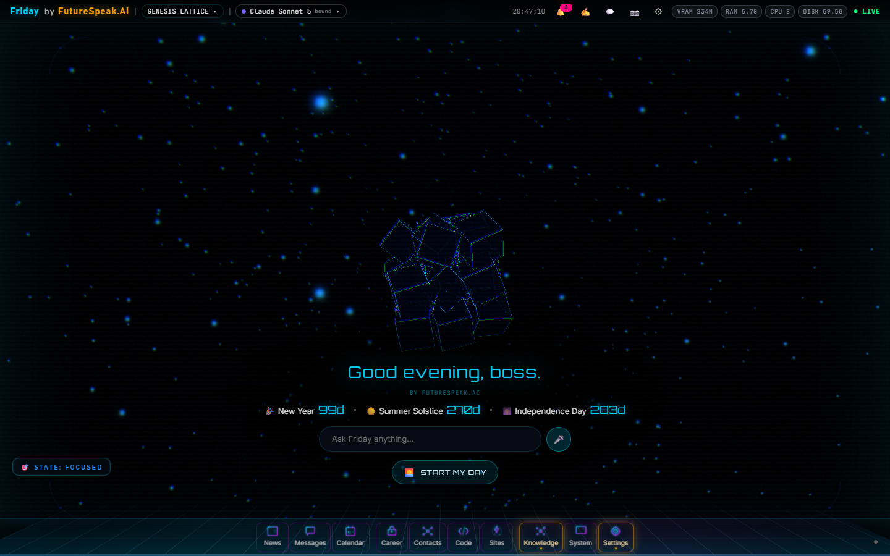
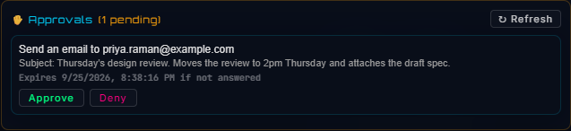
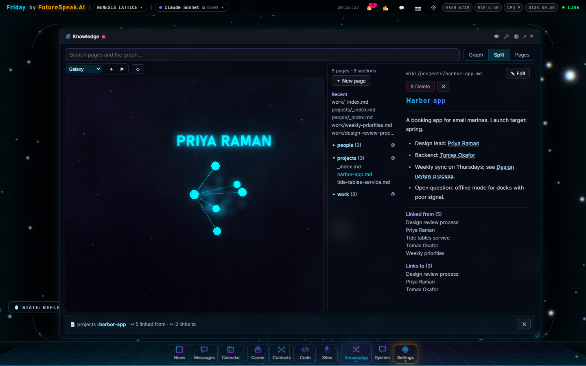
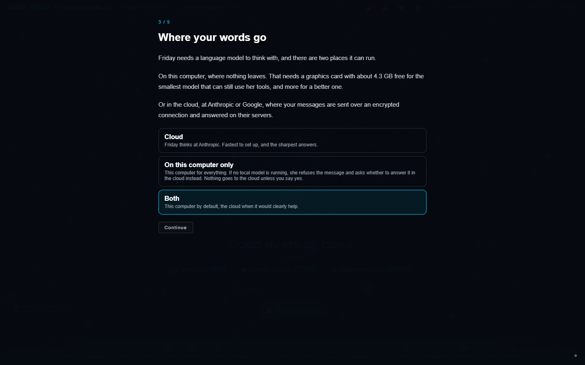

# Agent Friday

**A private AI agent that runs on your own Windows PC.** Your data and memory
stay on your machine. Friday shows which model is answering, asks before it
does anything outward on your behalf, and keeps a signed record of every
decision.

> Agent Friday Desktop is the standalone desktop application in this repository.
> It is distinct from the [Asimov's Mind Claude Code plugin](https://futurespeak.ai/asimovs-mind),
> a separate product built for the Claude Code environment.

## Why Friday

- **Your data stays home.** Your wiki, conversations, settings and receipts
  live in one folder on your PC. There is no Friday server and no account.
  Finance, health, legal and family records go in a vault encrypted with your
  passphrase.
- **You choose where it thinks.** A model on your own graphics card, a cloud
  model (Anthropic, Google, OpenRouter or any OpenAI-compatible provider), or
  both. Every reply says which model answered.
- **Nothing leaves without passing a gate.** Before anything goes to a cloud
  model, an egress gate on your PC withholds private and sensitive content. If
  the gate fails, nothing is sent.
- **It asks before it acts.** Reading and drafting run on their own. Sending,
  publishing, scheduling, installing and changing your files wait for your yes,
  an approval card, or a time-limited grant you created.
- **It keeps receipts.** Every decision is written to a signed log you can
  read.
- **No telemetry.** No analytics, crash reports or license checks. The update
  check is opt-in.

## What it does

- **Chat** with any model, in a panel, a window or its own browser tab, with a
  sidebar of every conversation grouped into projects.
- **Mail** (Messages): a Gmail client with search, threads, labels, drafts,
  scheduled send and undo. Friday drafts; every message is sent only after you
  approve it on a card.
- **Calendar and tasks**: Google Calendar and Google Tasks. Creating or
  changing an event asks first.
- **Knowledge**: your wiki pages and a 3D galaxy of how they connect, in one
  workspace.
- **Voice**: talk to Friday using on-device speech recognition and speech, or
  a cloud voice. Hold **Alt+T** anywhere in Windows to dictate into any app,
  transcribed on your PC.
- **Documents**: real Word, Excel and PowerPoint files made locally with
  OfficeCLI, checked visually before Friday calls them done.
- **Scheduled jobs**: briefings, the news front page and daily creation run on
  your local model by default.
- **Phone** (off by default): texts, voicemail and approvals by text through
  your own Twilio number.
- **News, Contacts, Code, Studio, Content** and more workspaces on a dock you
  can arrange.

## Requirements

- **Windows 10 or 11**, 64-bit. macOS and Linux can run the server from source
  without the tray, GPU planning or Windows credential protection; they are not
  the supported platform.
- **16 GB of RAM** or more.
- **About 8 GB of free disk** for the application, plus 7 to 19 GB for a local
  model.
- **For a local model: an NVIDIA graphics card.** Friday reads your card and
  offers the largest model that fits:

| Graphics memory | Local model offered |
|---|---|
| Under about 4.3 GB, or no NVIDIA card | None by default; use a cloud key |
| About 4.3 GB | Gemma 4 E2B |
| About 5.5 GB | Gemma 4 E4B |
| About 10 GB (a 12 GB card) | Gemma 4 12B |
| About 19.5 GB (a 24 GB card) | Gemma 4 26B |

AMD and Intel graphics are not detected. Local image generation needs an NVIDIA
card with about 8.5 GB or more. Without a suitable card, Friday works with a
cloud key (Anthropic recommended).

## Install

1. Download `AgentFriday-Setup-<version>.zip` from the
   [latest release](https://github.com/FutureSpeakAI/Agent-Friday/releases/latest).
2. Unzip it and double-click **Install Agent Friday.cmd**. No administrator
   rights are needed. The scripts are not code-signed, so SmartScreen may warn
   first.
3. Answer the questions: a cloud key only, or also a local model sized to your
   card; and whether Friday should start when you sign in.

Friday installs into `%LOCALAPPDATA%\AgentFriday` with its own copy of Python.
Your data lives separately in `%USERPROFILE%\.friday`, which updates never
touch. Details and troubleshooting:
[Installation](docs/getting-started/installation.md).

## Quick start

The first time Friday opens, it asks:

1. **A passphrase for the vault.** It encrypts your finance, health, legal and
   family records. You can skip it and set it later. **If you lose it, those
   files cannot be recovered.**
2. **Where your words go.** Cloud, on this computer only, or both. Nothing is
   pre-selected, and choosing cloud shows plainly what the provider will see.
3. **The part about other people.** What it means that Friday holds notes about
   people you mention.
4. **Checking for new versions.** Once a week, or never. Nothing downloads on
   its own either way.

Then a short setup chat: names, a hardware check, a checklist of every
account and key Friday can use (each says exactly what it asks for), optional
public-web research on you that keeps only what you approve, and a few
questions that set how Friday talks to you. It works with no model and no key,
every step can be skipped, and **Set up later** is always there. See
[The setup chat](docs/user-guide/setup-chat.md).

Open Friday from the desktop shortcut, which opens **http://localhost:3000**,
or from the tray icon's **Open Friday Desktop**. Optionally, give it a secure
local address such as **https://agent.friday** in Settings → General: Windows
asks you to confirm the hosts-file entry and to trust a certificate that can
vouch for that one name only.

Step by step: [Getting started](docs/user-guide/getting-started.md).

## Privacy and security

- **What stays on your PC:** everything Friday writes down. The vault is
  encrypted with your passphrase; keys and account tokens are encrypted; your
  wiki and conversations are ordinary files you can read.
- **What leaves:** what a cloud model needs to answer you, and only when a
  cloud model answers, after the egress gate. The gate withholds private and
  sensitive content, and it is honest about its limit: it matches patterns, so
  sensitive meaning in ordinary words can get through. In "On this computer
  only" mode, if no local model is running, Friday refuses the turn and offers
  to answer it in the cloud; nothing is sent until you choose.
- **What leaves on its own:** news feeds; health checks for services you
  connected; the page's fonts from Google Fonts, because this release does
  not ship the font files (Settings → Privacy & Approvals → Fonts turns that
  off); and, only if you said yes, the weekly update check. The connectivity
  probe sends nothing unless you opt in. MediaPipe and the embedding model
  are fetched only the first time you use the feature that needs them. Each
  is listed, with how to turn it off, in
  [Background network activity](docs/user-guide/background-network.md).
- **Remote access:** Friday listens only on this PC. A request that comes
  through a tunnel or proxy is never treated as you.

More: [Privacy: local and cloud](docs/user-guide/privacy.md),
[SECURITY.md](SECURITY.md), and the
[threat model](docs/security/threat-model.md).

## Approvals and receipts

Every action, from chat, voice, a scheduled job or a text message, passes one
checkpoint that fails closed.

| | Examples | What happens |
|---|---|---|
| **Internal** | reading, searching, drafting, generating, working in Friday's own folders | Runs |
| **Outward** | sending mail or texts, calendar changes, publishing, installing, overwriting your files, most commands | Waits for you |
| **Unknown** | a tool the checkpoint does not recognise | Treated as outward |

You answer with a **yes in chat** (it covers that exact action only), an
**approval card** (for background work, email, and anything whose details came
from content Friday read), or a **grant** you create for a scheduled job, which
names the job and actions and expires. Each decision is appended to
`~/.friday/decision-bom.jsonl`, signed with Friday's governance key. If the
receipt cannot be written, the action does not run.

More: [Approvals and receipts](docs/user-guide/approvals-and-receipts.md).

## Documentation

| | |
|---|---|
| [Getting started](docs/user-guide/getting-started.md) | Install, first run, the local address |
| User guide | [Approvals](docs/user-guide/approvals-and-receipts.md) · [Privacy](docs/user-guide/privacy.md) · [Mail](docs/user-guide/mail.md) · [Calendar](docs/user-guide/calendar.md) · [Voice](docs/user-guide/voice.md) · [Documents](docs/user-guide/documents.md) · [Scheduled jobs](docs/user-guide/scheduled-jobs.md) · [Phone](docs/user-guide/phone.md) |
| [Backup and restore](docs/user-guide/backup-and-restore.md) | What to back up, and what cannot be recovered |
| [Updating and uninstalling](docs/user-guide/updating-and-uninstalling.md) | Keeping your data across versions |
| [Configuration](docs/user-guide/configuration.md) | Every setting, environment variable and file |
| [Architecture](ARCHITECTURE.md) | How the pieces fit |
| [Known issues](KNOWN_ISSUES.md) · [Release notes](RELEASE_NOTES.md) · [Changelog](CHANGELOG.md) | What is new and what is not right yet |
| [All documentation](docs/README.md) | The full index |

## Support, security and contributing

- **Questions and bugs:** open an issue using the templates. Include your
  Windows version, how you installed Friday, and the relevant lines from
  `%USERPROFILE%\.friday\logs\`.
- **Security problems:** report privately as described in
  [SECURITY.md](SECURITY.md). Never in a public issue.
- **Contributing:** see [CONTRIBUTING.md](CONTRIBUTING.md) and the
  [Code of Conduct](CODE_OF_CONDUCT.md).

## License

MIT License. Copyright 2026 FutureSpeak.AI. See [LICENSE](LICENSE),
[NOTICE](NOTICE) and [THIRD_PARTY_LICENSES.md](THIRD_PARTY_LICENSES.md).
The Windows installer brings in some packages under other licenses, including
copyleft ones; NOTICE lists them.

Created by [FutureSpeak.AI](https://futurespeak.ai) · Built with Claude by
Anthropic as AI development partner.
