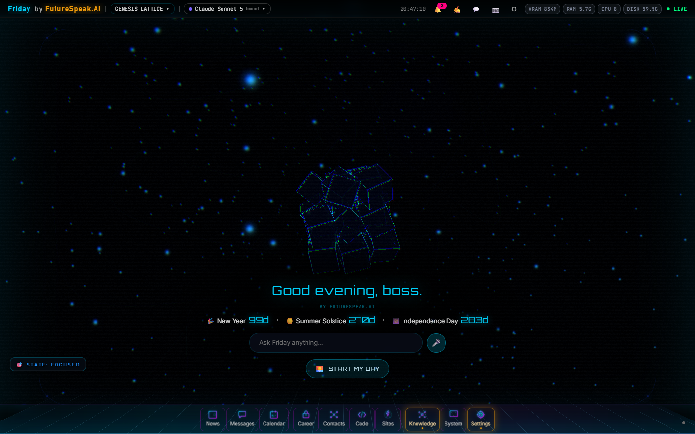
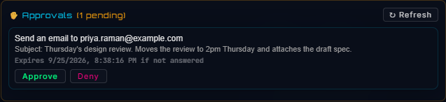
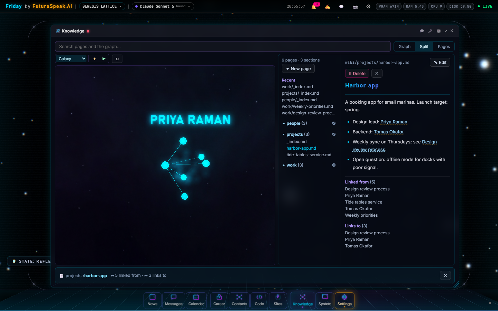

# Agent Friday™ by FutureSpeak.AI™

**A private AI agent that runs on your own Windows PC.** It chats, listens and
talks, drafts your mail, keeps your calendar, makes documents and remembers what
matters to you. Your data stays on your machine, it asks before it acts, and it
sends nothing about you anywhere.

Agent Friday™ Beta 1.0 is the first release of the app. It is a pre-release:
it is meant to be tried, and it has rough edges. They are listed in
[Known issues](KNOWN_ISSUES.md).

## Why Friday

- **Private by default.** Your wiki, conversations, settings and receipts live
  in one folder on your PC. There is no Friday server and no account. Finance,
  health, legal and family records go in a vault encrypted with your
  passphrase.
- **Local first, and yours.** Friday can think on your own graphics card or
  processor, in the cloud (Anthropic, Google, OpenRouter or any
  OpenAI-compatible provider), or both. Every reply says which model answered.
  The code is MIT licensed.
- **Zero telemetry.** No analytics, no crash reports, no license check. Friday
  connects to the internet only for things you use: the model providers you
  configure, model downloads you approve, the news or weather you open. The
  optional update check, which is off until you turn it on, contacts
  `api.github.com` once a week.
- **You approve actions.** Reading and drafting run on their own. Sending,
  publishing, scheduling, installing and changing your files wait for your yes,
  and every decision is written to a signed log you can read.

## What it does

- **Chat** with any model, in a panel, a window or its own browser tab, with a
  sidebar of every conversation grouped into projects.
- **Voice.** Talk to Friday with on-device listening and speaking, or a cloud
  voice. Hold **Alt+T** anywhere in Windows to dictate into any app,
  transcribed on your PC.
- **See & Touch.** Friday sees what your open workspace shows, points at rows
  with numbered badges, ticks or filters what you mean, and fills in a field you
  can see. Acting on what is ticked still needs your approval.
- **Mail and calendar.** A Gmail client and Google Calendar and Tasks. Friday
  drafts, and sends or changes only after you approve a card.
- **Library and Media.** Documents you add, read on your PC and answered with
  footnotes, and a media workspace with search, previews and transcripts.
- **Documents.** Real Word, Excel and PowerPoint files made locally and checked
  visually before Friday calls them done.
- **Workflows, scheduled jobs and podcasts.** Reusable procedures with checked
  results, briefings and daily work on your local model by default, and
  podcast episodes written by your local model and spoken on your processor.
- **Phone** (off by default): texts, voicemail and approvals by text through
  your own Twilio number.

## Download

1. Download `AgentFriday-Setup-1.0.0-beta.1.exe` (about 640 MB) from the
   [latest release](https://github.com/FutureSpeakAI/Agent-Friday/releases/latest).
2. Check its SHA-256 against the one on the release page, then run it. The setup
   program is not code-signed yet, so Windows SmartScreen shows **Unknown
   publisher**. Choose **More info**, then **Run anyway**.
3. Choose your models. Setup reads your memory, graphics card and disk and shows
   only what fits. Or choose a cloud model.

The file carries its own Python and every package, so you need nothing else.
Step by step: [Getting started](docs/getting-started/README.md). If you run a
5.x version, the same installer keeps your vault, memory and settings.

## System requirements

| | Minimum | Recommended |
|---|---|---|
| Windows | 10 or 11, 64-bit | 11 |
| Memory | 16 GB for the local model Friday is tuned for | 32 GB |
| Processor | 4 physical cores with AVX2 | |
| Graphics card | None (the model runs on the processor, slowly) | NVIDIA with 12 GB or more of video memory |
| Free disk | About 8 GB for the program, plus models (about 6 GB for the deep thinker) | More, if you keep two local models |

Machines below 16 GB of memory use a cloud model, or the older, lighter local
models setup offers when they fit. Only NVIDIA cards are read for video memory.
Sizing by graphics card, and what to expect, is in
[Troubleshooting](docs/user-guide/troubleshooting.md#friday-is-very-slow-or-windows-runs-out-of-memory).

## Privacy and security

- **What stays on your PC:** everything Friday writes down. The vault is
  encrypted with your passphrase; keys and account tokens are encrypted; your
  wiki and conversations are ordinary files you can read.
- **What leaves:** what a cloud model needs to answer you, and only when a cloud
  model answers, after the egress gate. The gate withholds private and
  sensitive content, and it matches patterns, so sensitive meaning in ordinary
  words can get through. In "On this computer only" mode with no local model
  running, Friday refuses the turn and offers to answer it in the cloud; nothing
  is sent until you choose.
- **What leaves on its own:** news feeds; health checks for services you
  connected; and, only if you said yes, the weekly update check. The page's
  fonts are bundled, so they make no request. The connectivity probe
  sends nothing unless you opt in. Models and helper downloads happen only when
  you approve them. Each is listed, with how to turn it off, in
  [Background network activity](docs/user-guide/background-network.md).
- **Remote access:** Friday listens only on this PC. A request that comes
  through a tunnel or proxy is never treated as you.

More in [Privacy: local and cloud](docs/user-guide/privacy.md),
[SECURITY.md](SECURITY.md) and the [threat model](docs/security/threat-model.md).

## Documentation

| | |
|---|---|
| [Getting started](docs/getting-started/README.md) | Download, SmartScreen, setup, first conversation, voice |
| [User guide](docs/README.md#user-guide) | Settings, See & Touch, Library, Media, Chat Hub, Podcasts, Workflows, Mail, Calendar, Voice and more |
| [Troubleshooting](docs/user-guide/troubleshooting.md) and [FAQ](docs/user-guide/faq.md) | Fixes for real failures, logs, backup, uninstall |
| [Release notes](RELEASE_NOTES.md), [Changelog](CHANGELOG.md), [Known issues](KNOWN_ISSUES.md) | What is in Beta 1.0 and what is not right yet |

## For developers

Friday is a Python server (`src/agent_friday/`) with a single-file browser UI
(`index.html`), a Windows tray, and a Windows installer. [ARCHITECTURE.md](ARCHITECTURE.md)
describes how the pieces fit, and [CONTRIBUTING.md](CONTRIBUTING.md) covers
building from source, the required checks and how to submit changes. Report
security problems privately, as described in [SECURITY.md](SECURITY.md). Please
follow the [Code of Conduct](CODE_OF_CONDUCT.md).

## License

MIT License. Copyright 2026 FutureSpeak.AI. See [LICENSE](LICENSE),
[NOTICE](NOTICE) and [THIRD_PARTY_LICENSES.md](THIRD_PARTY_LICENSES.md).
The Windows installer brings in some packages under other licenses, including
copyleft ones; NOTICE lists them.

Agent Friday™ and FutureSpeak.AI™ are trademarks of FutureSpeak.AI.
Agent Friday™ is distinct from the
[Asimov's Mind Claude Code plugin](https://futurespeak.ai/asimovs-mind), a
separate product.

Created by [FutureSpeak.AI™](https://futurespeak.ai). Built with Claude by
Anthropic as AI development partner.
