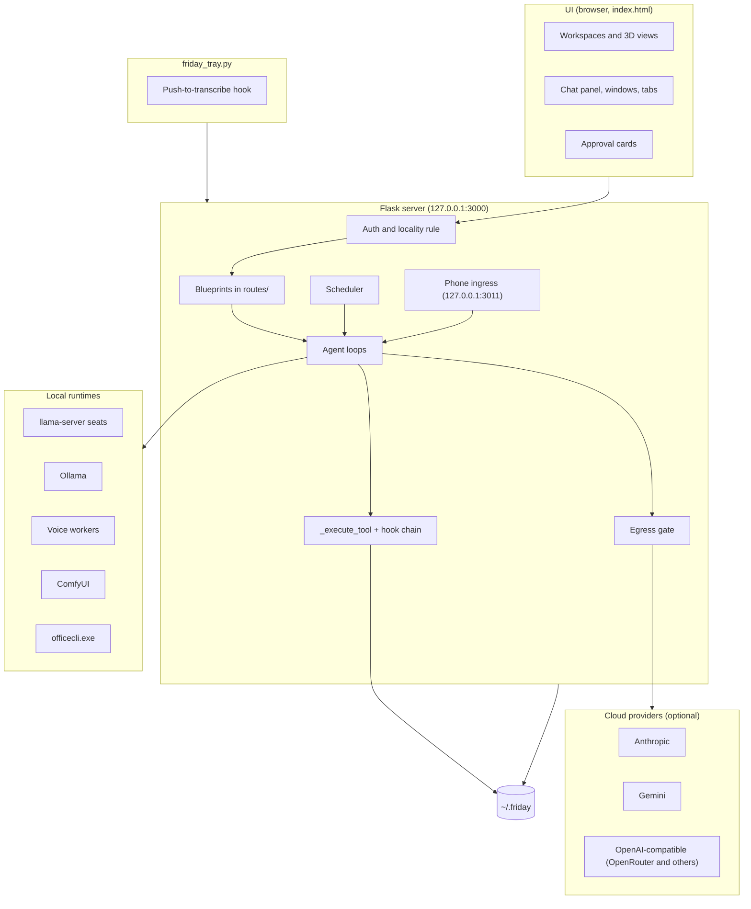
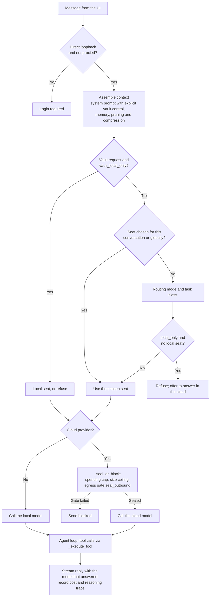
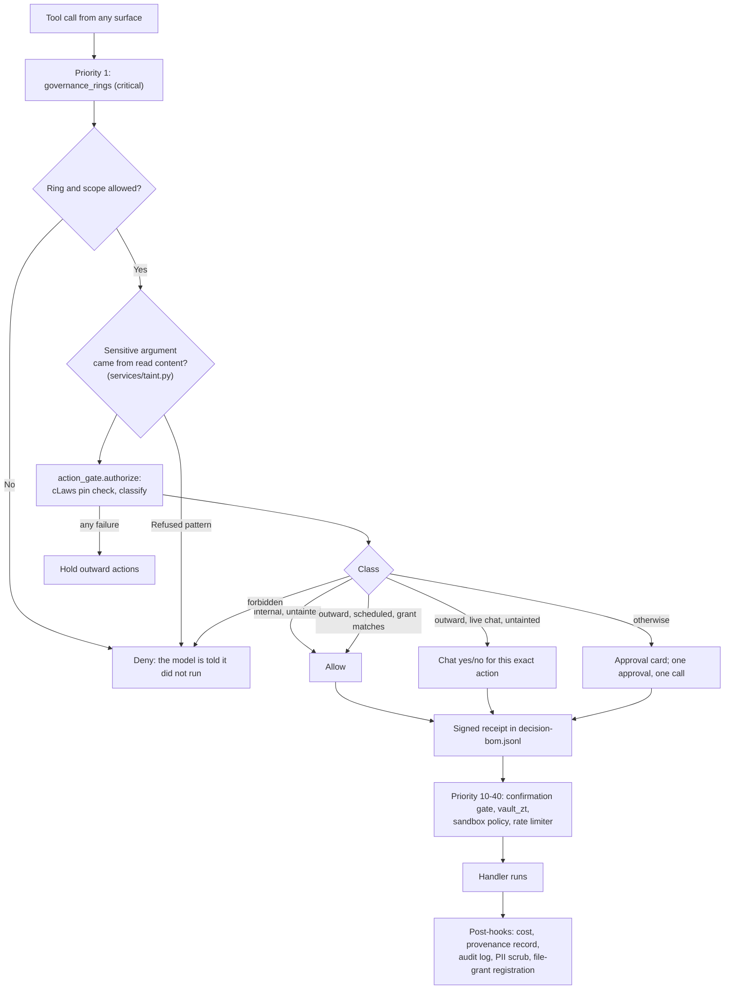
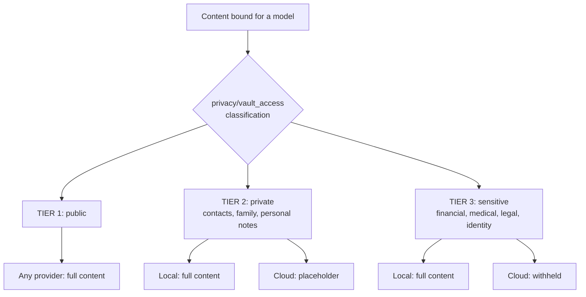

# Architecture overview

> Status: current for 5.14.0. Last verified against the code: 2026-09-24.
> The top-level [ARCHITECTURE.md](../../ARCHITECTURE.md) is the short
> description of processes, the request flow and the governance hook chain.
> This page adds diagrams. Paths are relative to `src/agent_friday/`.

---

## System overview

Every OpenAI-compatible endpoint, local or cloud, runs through the same agentic
tool loop (`services/agent._oai_agentic_loop`); Anthropic models run the Claude
tool loop. Both dispatch tools through `_execute_tool`.

---

## A chat turn

---

## The governance checkpoint

The table of hooks and what each one does is in
[ARCHITECTURE.md](../../ARCHITECTURE.md#tool-dispatch-and-the-governance-hook-chain).
The privilege rings still exist inside `_governance_check`: ring 0 and 1 tools
always pass the ring check, ring 2 needs an authenticated or background
session, and ring 3 (mouse, keyboard, screen) needs computer control to be
enabled. The rings decide whether a tool may be considered at all; the action
gate decides whether it may act without you.

---

## Vault tiers

Assembly-time gating happens while the prompt is built; the egress gate
enforces the same policy again on the finished payload. Egress decisions are
logged to `~/.friday/vault/egress-log.jsonl`. The classifier's layers, and what
each build actually runs, are in the [threat model](../security/threat-model.md).

---

## Voice

The microphone button asks `GET /api/voice/session-info` which WebSocket to
use for the configured engine:

- **`/ws/voice-local`** (the default): on-device speech recognition
  (faster-whisper) and speech (Piper, or Kokoro on a GPU), or the NVIDIA NeMo
  GPU tier. GPU engines run in leased worker processes
  (`services/voice_workers.py`) that the residency arbiter can evict to the
  CPU with a notice.
- **`/ws/live`**: Gemini Live, used only when the voice engine is `gemini`.

Tools called from voice go through `_execute_tool` like any other, and the
action permission policy ends both voice prompts.

Push-to-transcribe is separate from conversation: the tray's keyboard hook
(`services/push_to_talk.py`) records while the key is held and asks the
server's local speech recogniser for the text, then types it into the window
that had focus when the key went down.

---

## Components that exist but are not wired

- **Federation and Economy** Settings panels are hidden
  (`SETTINGS_SHOW_HELD_FEATURES = false`); their routes and data remain.

---

## Storage

Everything Friday keeps is under `~/.friday` (or `$FRIDAY_HOME`). The full
layout, with what is encrypted, is in the
[configuration reference](../user-guide/configuration.md#what-lives-in-friday).
